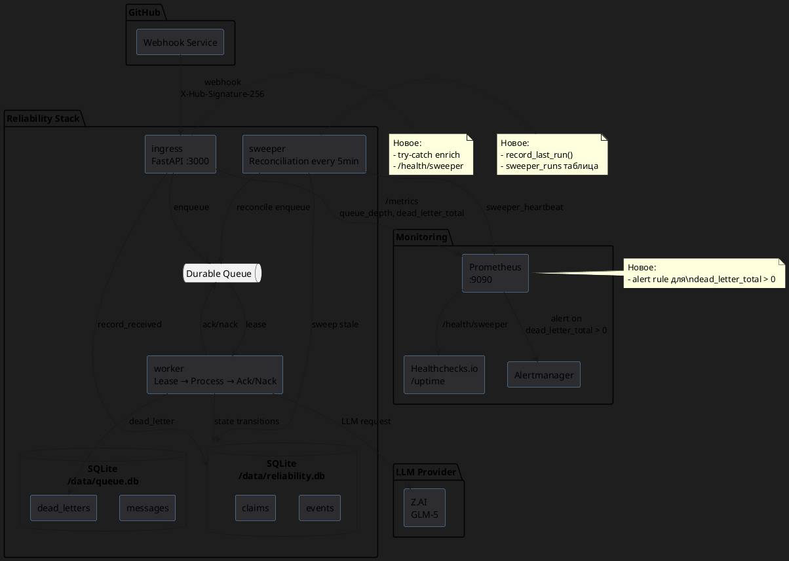
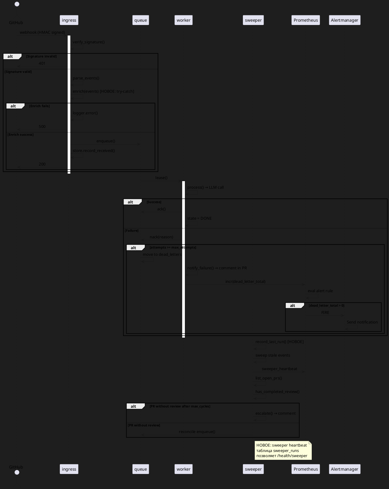

# Системные требования: Мониторинг и быстрая отработка сбоев PR-Agent

**FNR-1: Надёжность — PR-Agent не должен падать «в тишину»**

---

## 1. Введение

### 1.1. Метаданные

| Поле | Значение |
|------|----------|
| **Документ** | Системные требования: Мониторинг и быстрая отработка сбоев |
| **Версия** | 1.0 |
| **Дата** | 2026-07-23 |
| **Статус** | Проект |
| **Автор** | Системный аналитик |
| **FNR** | FNR-1 |
| **Выбранный концепт** | Концепт 2 (Прагматичное — Мониторинг + быстрый rollback) |

### 1.2. Термины и определения

| Термин | Определение |
|--------|-------------|
| **Reliability-стек** | Архитектура `self-hosted/reliability/` с компонентами ingress, worker, sweeper |
| **Тихое падение** | Ситуация, когда событие теряется без видимого пользователю уведомления |
| **DLQ (Dead-letter queue)** | Очередь для сообщений, которые не удалось обработать после всех попыток |
| **Sweeper** | Фоновый процесс, проверяющий пропущенные webhook'ы и дозапускающий обработку |
| **Heartbeat** | Механизм проверки, что процесс запущен и активен |
| **Reconciliation** | Процесс восстановления пропущенных или застрявших событий |
| **Backpressure** | Механизм откладывания задач при достижении rate limit |

### 1.3. Связанные документы

| Документ | Расположение |
|----------|--------------|
| Постановка задачи | `sa_documentation/FNR/FNR_1/task.md` |
| Концепты решений | `sa_documentation/FNR/FNR_1/concept.md` |
| Архитектура reliability-стека | `self-hosted/ARCHITECTURE.md` |
| Go-live процедура | `self-hosted/GO-LIVE.md` |
| Существующие СТ | `self-hosted/SYSTEM-REQUIREMENTS.md` |

### 1.4. История изменений

| Версия | Дата | Автор | Изменение |
|--------|------|-------|-----------|
| 1.0 | 2026-07-23 | Системный аналитик | Создание документа на основе Концепта 2 |

---

## 2. Общее описание

### 2.1. As-Is: Текущее состояние

Reliability-стек **УЖЕ реализован** и решает 90% проблем legacy-архитектуры:

| Компонент | Файл | Решает проблему | Статус |
|-----------|------|-----------------|--------|
| Durable queue | `reliability/queue.py:14-50` | Потеря при рестарте (СТ-6) | ✅ Работает |
| Dead-letter queue | `reliability/queue.py:dead_letter` | Тихий провал → видимый коммент (СТ-27) | ✅ Работает |
| Circuit breaker | `reliability/gateway.py:3135-3174` | Зависание на мёртвом провайдере (СТ-22) | ✅ Работает |
| Rate limiter | `reliability/gateway.py:TokenBucket` | 429 от Z.AI (СТ-20) | ✅ Работает |
| Reconciliation sweeper | `reliability/sweeper.py` | Пропущенные webhook'ы (СТ-29) | ✅ Работает |
| State machine | `reliability/state.py` | Наблюдаемость (К-5) | ✅ Работает |

**Остаточные сценарии тихих падений (ещё не закрыты):**

1. **Исключение ДО enqueue в ingress** — `enrich(events)` падает → событие потеряно
2. **GitHub пропускает webhook** — внешний фактор, sweeper должен ловить
3. **Смерть после ack, до публикации** — процесс умирает между ack и публикацией
4. **Sweeper не запущен** — DLQ растёт, никто не знает

**Доказательство кода (As-Is):**

```python
# reliability/ingress.py:46-50 — уязвимое место для сценария 1
events = parse_events(event_type, delivery, payload)
events = enrich(events)  # <-- может упасти здесь, события потеряны
enqueued = deduped = 0
for event in events:
    if store.record_received(event):  # <-- сюда не дойдём
        schedule(event)

# reliability/worker.py:69-71 — уязвимое место для сценария 3
if result.state == State.DONE or result.skipped:
    queue.ack(lease.id, lease.token)  # ack успешен
    metrics.incr("processed_ok")
    # Если процесс УМИРАЕТ здесь — ack потерян, DLQ не сработает
```

### 2.2. Архитектурное решение

Выбран **Концепт 2 (Прагматичное)** — минимальные изменения для максимального покрытия:

| Решение | Сценарий | Эффект |
|---------|----------|--------|
| Try-catch вокруг enrich + logger | #1 Exception до enqueue | Логируется, не предотвращает |
| Sweeper heartbeat таблица + healthcheck | #4 Sweeper down | Детектируется внешним алертом |
| Prometheus alert на dead_letter_total | #1, #2, #3 | Алерт при росте DLQ |
| GO-LIVE rollback процедура | Все сценарии | Быстрый откат при проблемах |

**Что НЕ меняется:** ingress core logic, worker core logic, queue, gateway, state machine.

### 2.3. Диаграмма компонентов



### 2.4. Схема последовательности: Happy Path + Failure Detection



---

## 3. План миграции

### 3.1. Этапы внедрения (Activity Diagram)

```plantuml
@startuml
skinparam backgroundColor #1e1e1e
skinparam activityBackgroundColor #2d2d30
skinparam activityBorderColor #6aa6e0

start

:Этап 1: Подготовка;
note right
  - Создать ветку fnr1-monitoring
  - Дизайн таблицы sweeper_runs
  - Подготовить alert rule
end note

:Этап 2: Реализация;
note right
  - Добавить try-catch в ingress
  - Создать sweeper_runs таблицу
  - Добавить record_last_run()
  - Создать /health/sweeper
  - Добавить Prometheus alert
end note

:Этап 3: Тестирование;
note right
  - Unit тесты для new code
  - Интеграционные тесты
  - Chaos тест: остановить sweeper
  - Проверка alert trigger
end note

:Этап 4: Smoke test;
note right
  - Запустить на тестовом окружении
  - scripts/smoke.sh
  - Проверить /health/sweeper
  - Проверить alert в Prometheus
end note

if "Smoke passed?" then (Да)
  :Этап 5: Go-live;
  note right
    - docker compose up -d --build
    - Проверить /metrics
    - Monitor alerts
  end note

  if "Проблемы?" then (Да)
    :Rollback;
    note right
      - docker compose down
      - docker compose -f docker-compose.legacy-pr-agent.yml up -d
    end note
  else (Нет)
    :Мониторинг 24ч;
    stop
  endif
else (Нет)
  :Фикс багов;
  repeat
    :Чиним;
    :Тестируем;
  repeat while (Баги?)
  :Go-live;
  stop
endif

stop
@enduml
```

### 3.2. Таблица этапов с откатами

| Этап | Действия | Критерий успеха | rollback |
|------|----------|-----------------|----------|
| **1. Подготовка** | Создание ветки, дизайн таблицы, подготовка alert rule | Дизайн одобрен, ветка создана | Удалить ветку |
| **2. Реализация** | Кодирование изменений | Unit tests pass, код ревью пройдено | git revert |
| **3. Тестирование** | Интеграционные тесты, chaos тесты | Все тесты pass, alert срабатывает | git revert |
| **4. Smoke test** | Запуск на тестовом окружении | smoke.sh pass, /health/sweeper отвечает | docker compose down |
| **5. Go-live** | Деплой на прод | /metrics ok, alerts configured | docker compose down; legacy compose up |
| **6. Мониторинг** | Наблюдение 24ч | dead_letter_total stable, нет алертов | Legacy rollback |

### 3.3. Критерии готовности

| Критерий | Проверка | Ответственный |
|----------|----------|---------------|
| Unit тесты pass | `python -m unittest discover -s reliability/tests` | Разработчик |
| Smoke test pass | `BASE_URL=http://127.0.0.1:3000 ./scripts/smoke.sh` | QA |
| /health/sweeper отвечает | `curl http://host:3000/health/sweeper` | QA |
| Prometheus alert configured | `curl http://prometheus:9090/api/v1/rules` | DevOps |
| Dead-letter растёт → alert | Имитация: сломать LLM, ждать alert | QA |
| Rollback задокументирован | GO-LIVE.md §5 актуален | DevOps |

---

## 4. Функциональные требования — Backend / БД / API

### 4.1. Категории задач

| ID | Задача | Приоритет | Сложность | Ответственный |
|----|--------|-----------|-----------|----------------|
| **FR-1** | Try-catch вокруг enrich в ingress | P0 | Легко | Backend Dev |
| **FR-2** | Sweeper heartbeat таблица | P0 | Легко | Backend Dev |
| **FR-3** | Эндпоинт /health/sweeper | P0 | Легко | Backend Dev |
| **FR-4** | Prometheus alert rule | P1 | Легко | DevOps |
| **FR-5** | Обновить GO-LIVE.md §5 | P1 | Легко | Tech Writer |

---

### FR-1: Try-catch вокруг enrich в ingress

#### Метаданные

| Поле | Значение |
|------|----------|
| **Ответственный за тех. реализацию** | Backend Developer |
| **Задача на разработку** | FNR-1/FR-1 |
| **Jira** | - |
| **Статус** | New |

#### Описание

Добавить обработку исключений вокруг вызова `enrich(events)` в `ingress.py`. При падении enrich логировать ошибку и возвращать 500, чтобы GitHub мог retry.

**Текущее поведение (уязвимо):**
```python
# reliability/ingress.py:46-50
events = enrich(events)  # Может упасти, событие потеряно
```

**Новое поведение:**
```python
try:
    events = enrich(events)
except Exception as e:
    logger.error("enrich failed: %s", e, exc_info=True)
    return 500  # GitHub retry
```

#### Обоснование

- Сценарий #1: Exception до enqueue — событие терялось в тишину
- Enrich делает простой HEAD-запрос к GitHub, но может упасти при network issues
- Возврат 500 позволяет GitHub retry по семантике webhook delivery

#### Затрагиваемые компоненты

| Компонент | Файл | Изменения |
|-----------|------|-----------|
| ingress logic | `reliability/ingress.py:46-50` | Добавить try-catch |
| logger | уже настроен | Использовать существующий |

#### Критерии приёмки

1. Unit test: enrich падает → возвращается 500
2. Интеграционный тест: enrich падает → логируется
3. Chaos тест: enrich падает → GitHub retry успешен

#### Зависимости

- Нет

#### Нефункциональные требования

| Параметр | Значение |
|----------|----------|
| Производительность | try-catch не должен замедлять happy path |
| Логирование | Ошибка логируется с exc_info=True |
| Обратная совместимость | Не меняет контракт функции handle_webhook |

---

### FR-2: Sweeper heartbeat таблица

#### Метаданные

| Поле | Значение |
|------|----------|
| **Ответственный за тех. реализацию** | Backend Developer |
| **Задача на разработку** | FNR-1/FR-2 |
| **Jira** | - |
| **Статус** | New |

#### Описание

Создать таблицу `sweeper_runs` в `/data/reliability.db` для записи timestamp последнего успешного run sweeper'а.

**DDL:**
```sql
CREATE TABLE IF NOT EXISTS sweeper_runs (
    id INTEGER PRIMARY KEY AUTOINCREMENT,
    last_run_timestamp INTEGER NOT NULL,  -- unix timestamp
    last_status TEXT NOT NULL,            -- 'ok' или 'error'
    error_message TEXT,                  -- null при status='ok'
    created_at INTEGER DEFAULT (strftime('%s', 'now'))
);

CREATE INDEX IF NOT EXISTS idx_sweeper_runs_timestamp
ON sweeper_runs(last_run_timestamp DESC);
```

**Операция:**
```sql
-- Запись успешного run (в конце каждого sweep-цикла)
INSERT INTO sweeper_runs (last_run_timestamp, last_status)
VALUES (strftime('%s', 'now'), 'ok');

-- Чтение для /health/sweeper
SELECT last_run_timestamp, last_status
FROM sweeper_runs
ORDER BY id DESC
LIMIT 1;
```

#### Обоснование

- Сценарий #4: Sweeper не запущен — DLQ растёт, никто не знает
- Heartbeat таблица позволяет внешнему алерту детектировать "мёртв" sweeper
- Простая таблица — минимальные изменения, работает с существующей SQLite

#### Затрагиваемые компоненты

| Компонент | Файл | Изменения |
|-----------|------|-----------|
| State store | `reliability/state.py` | Добавить миграцию sweeper_runs |
| Sweeper | `reliability/sweeper.py` | Добавить record_last_run() |
| Tests | `reliability/tests/` | Unit тесты для record_last_run |

#### Критерии приёмки

1. Unit test: record_last_run() создаёт запись в таблице
2. Интеграционный тест: sweeper завершает цикл → запись есть
3. Migration test: таблица создаётся при первом запуске

#### Зависимости

- FR-1 (независимая задача)

#### Нефункциональные требования

| Параметр | Значение |
|----------|----------|
| Производительность | INSERT каждую ~5 минут — не критично |
| Хранение | Таблица растёт медленно, purge не нужен |
| Конкурентный доступ | Только один sweeper процесс — гонок нет |

---

### FR-3: Эндпоинт /health/sweeper

#### Метаданные

| Поле | Значение |
|------|----------|
| **Ответственный за тех. реализацию** | Backend Developer |
| **Задача на разработку** | FNR-1/FR-3 |
| **Jira** | - |
| **Статус** | New |

#### Описание

Добавить эндпоинт `/health/sweeper` в `app.py`, который возвращает статус sweeper'а на основе таблицы `sweeper_runs`.

**Логика:**
```python
@app.get("/health/sweeper")
def health_sweeper():
    row = _store.get_last_sweeper_run()
    if row is None:
        return {"status": "unknown", "message": "No runs yet"}, 503
    last_run = row["last_run_timestamp"]
    status = row["last_status"]
    now = int(time.time())
    age = now - last_run
    # Sweeper запускается каждые ~5 мин (RELIABILITY_SWEEP_INTERVAL)
    # Если age > 600 (10 минут) — считаем мёртвым
    if age > 600:
        return {
            "status": "unhealthy",
            "last_run": last_run,
            "age_seconds": age,
            "message": "Sweeper is stale"
        }, 503
    if status != "ok":
        return {
            "status": "error",
            "last_run": last_run,
            "last_status": status
        }, 503
    return {
        "status": "healthy",
        "last_run": last_run,
        "age_seconds": age
    }, 200
```

**Семантика HTTP кодов:**
- 200: Sweeper жив и свежий
- 503: Sweeper мёртв, stale, или ещё не запускался

#### Обоснование

- Внешний healthcheck (healthchecks.io, UptimeRobot) может дергать `/health/sweeper`
- При 503 — алерт на email/slack
- Работает в связке с FR-2 (heartbeat таблица)

#### Затрагиваемые компоненты

| Компонент | Файл | Изменения |
|-----------|------|-----------|
| FastAPI app | `reliability/app.py` | Добавить /health/sweeper |
| State store | `reliability/state.py` | Добавить get_last_sweeper_run() |

#### API specification

| Метод | Путь | Response |
|-------|------|----------|
| GET | `/health/sweeper` | 200 + JSON или 503 + JSON |

**Формат ответа (200 healthy):**
```json
{
  "status": "healthy",
  "last_run": 1721737200,
  "age_seconds": 123
}
```

**Формат ответа (503 unhealthy):**
```json
{
  "status": "unhealthy",
  "last_run": 1721736000,
  "age_seconds": 1200,
  "message": "Sweeper is stale"
}
```

#### Критерии приёмки

1. Unit test: get_last_sweeper_run() возвращает row
2. Интеграционный тест: /health/sweeper возвращает 200 при свежем run
3. Chaos тест: остановить sweeper → /health/sweeper возвращает 503

#### Зависимости

- FR-2 (требует heartbeat таблицу)

#### Нефункциональные требования

| Параметр | Значение |
|----------|----------|
| Таймаут ответа | < 100ms (простой SELECT) |
| Rate limit | Не нужен (healthcheck ~1/min) |
| Кеш | Не нужен |

---

### FR-4: Prometheus alert rule

#### Метаданные

| Поле | Значение |
|------|----------|
| **Ответственный за тех. реализацию** | DevOps |
| **Задача на разработку** | FNR-1/FR-4 |
| **Jira** | - |
| **Статус** | New |

#### Описание

Добавить alert rule в Prometheus для детекции роста dead-letter queue.

**Alert rule (YAML):**
```yaml
groups:
  - name: reliability
    interval: 30s
    rules:
      - alert: DeadLetterQueueGrowing
        expr: |
          increase(reliability_dead_letter_total[5m]) > 0
        for: 2m
        labels:
          severity: warning
          component: reliability
        annotations:
          summary: "Dead-letter queue is growing"
          description: "DLQ increased by {{ $value }} in last 5m. Check worker logs."
          runbook_url: "https://docs.example.com/runbooks/dead-letter"

      - alert: SweeperUnhealthy
        expr: |
          up{job="reliability", endpoint="sweeper"} == 0
        for: 5m
        labels:
          severity: critical
          component: sweeper
        annotations:
          summary: "Sweeper healthcheck failing"
          description: "/health/sweeper returning 503 for 5m"
          runbook_url: "https://docs.example.com/runbooks/sweeper-down"
```

**Альтернатива (без отдельного scrape endpoint для sweeper):**
```yaml
      - alert: SweeperStale
        expr: |
          time() - reliability_sweeper_last_run_timestamp > 600
        for: 5m
        labels:
          severity: critical
        annotations:
          summary: "Sweeper is stale"
          description: "Last successful run was {{ $value | humanizeDuration }} ago"
```

#### Обоснование

- DLQ растёт → реальная проблема (LLM down, ключ неверный, и т.д.)
- Алерт позволяет быстро реагировать, вместо "замечания через неделю"
- Sweeper stale → reconciliation не работает → пропущенные webhook'ы не дозапускаются

#### Затрагиваемые компоненты

| Компонент | Файл | Изменения |
|-----------|------|-----------|
| Prometheus config | `prometheus.yml` (новый или дополнение) | Добавить alert rule |
| Metrics | `reliability/metrics.py` | Возможно добавить sweeper_last_run_timestamp gauge |

#### Критерии приёмки

1. Alert rule загружается в Prometheus без ошибок
2. Имитация: сломать LLM → DLQ растёт → alert срабатывает
3. Имитация: остановить sweeper → alert SweeperStale срабатывает

#### Зависимости

- FR-2 (для SweeperStale alert)
- Требует развернутый Prometheus

#### Нефункциональные требования

| Параметр | Значение |
|----------|----------|
| False positives | for: 2m/5m снижает |
| Notification routing | severity: warning → Slack, critical → PagerDuty |

---

### FR-5: Обновить GO-LIVE.md §5

#### Метаданные

| Поле | Значение |
|------|----------|
| **Ответственный за тех. реализацию** | Tech Writer / DevOps |
| **Задача на разработку** | FNR-1/FR-5 |
| **Jira** | - |
| **Статус** | New |

#### Описание

Обновить секцию "Откат (rollback)" в `GO-LIVE.md` с учётом новых механик (heartbeat, healthchecks).

**Добавить:**
```markdown
### 5.1. Признаки проблем

**Мониторить следующие сигналы:**

1. `dead_letter_total` растёт → DLQ растёт, worker не справляется или LLM down
2. `/health/sweeper` возвращает 503 → Sweeper мёртв или stale
3. `reconcile_escalated_total` растёт → Sweeper эскалирует (возможно, реальная проблема с PR)

**Признаки → действие:**

| Признак | Действие | Rollback? |
|--------|----------|-----------|
| DLQ растёт, /health/sweeper=ok | Проверить LLM, починить ключ | Нет |
| /health/sweeper=503 | Перезапустить sweeper контейнер | Нет |
| Оба сигнала бедствия + время > 15 мин | Legacy rollback | Да |

### 5.2. Rollback команда

```bash
docker compose down
docker compose -f docker-compose.legacy-pr-agent.yml up -d --build
```
```

#### Обоснование

- GO-LIVE.md уже существует, но не описывает новые сигналы проблем
- Чёткий критерий "Когда rollback" важен для операций
- Документация помогает при handover

#### Затрагиваемые компоненты

| Компонент | Файл | Изменения |
|-----------|------|-----------|
| Documentation | `self-hosted/GO-LIVE.md` | Добавить §5.1, §5.2 |

#### Критерии приёмки

1. Документация обновлена
2. Ревью approved
3. Ссылки валидны

#### Зависимости

- Нет

---

## 5. Требования к интерфейсам — Frontend / UI

**Не применимо** — Документ описывает только backend-изменения. UI/Web-интерфейс не затрагивается.

---

## 6. Ревью требований

| Роль | Имя | Статус | Комментарии |
|------|-----|--------|-------------|
| **Аналитик** | - | New | Требуется ревью |
| **Разработчик Backend** | - | New | Требуется ревью |
| **Разработчик Frontend** | - | N/A | Не применимо |
| **QA** | - | New | Требуется ревью |
| **DevOps** | - | New | Требуется ревью |

---

## 7. Риски и ограничения

### 7.1. Таблица рисков

| ID | Риск | Вероятность | Влияние | Митигация |
|----|------|-------------|---------|-----------|
| **R-1** | Sweeper heartbeat создаёт false positive (алёрт при работающем sweeper) | Средняя | Низкое | Добавить hysteresis (10 мин), проверить на нагрузке |
| **R-2** | Prometheus недоступен → алерты не работают | Низкая | Высокое | Дублировать алерт через healthchecks.io |
| **R-3** | Try-catch enrich маскирует реальную проблему (enrich падает часто) | Низкая | Среднее | Мониторить 500 rate от ingress |
| **R-4** | Dokploy cron complexity — сложно настроить внешний алерт | Средняя | Низкое | Использовать встроенный Prometheus, а не cron |
| **R-5** | Rollback не покрывает данные в очереди (события потеряны при откате) | Низкая | Среднее | Документировать: данные в reliability-data сохраняются |

### 7.2. Ограничения

1. **Heartbeat ≠ работоспособность** — Sweeper может писать heartbeat, но sweep-логика не работать (например, GitHub API недоступен). Митигация: проверять `/health/sweeper` + наблюдать за `reconcile_requeues` метрикой.

2. **External алерты требуют внешней инфры** — healthchecks.io, UptimeRobot или Prometheus+Alertmanager. Если внешняя инфра недоступна, алерты не работают.

3. **Покрытие не 100%** — Сценарии #1 и #3 только частично закрываются (логируются/эскалируются), но не предотвращаются полностью. Полное покрытие требует Концепта 1 (transactional enqueue + post-publish assertion).

4. **Один узел** — Heartbeat таблица в SQLite работает для одного узла. При multi-node нужна race condition защита или другая БД.

---

## 8. Приложения

### 8.1. SQL-скрипты

**Создание таблицы sweeper_runs:**
```sql
-- reliability/ migrations/add_sweeper_runs.sql
CREATE TABLE IF NOT EXISTS sweeper_runs (
    id INTEGER PRIMARY KEY AUTOINCREMENT,
    last_run_timestamp INTEGER NOT NULL,
    last_status TEXT NOT NULL,
    error_message TEXT,
    created_at INTEGER DEFAULT (strftime('%s', 'now'))
);

CREATE INDEX IF NOT EXISTS idx_sweeper_runs_timestamp
ON sweeper_runs(last_run_timestamp DESC);

-- Для testing: вставить фейковый run
INSERT INTO sweeper_runs (last_run_timestamp, last_status)
VALUES (strftime('%s', 'now'), 'ok');
```

### 8.2. Маппинг сценарий → решения

| Сценарий | Решение | Задача | Покрытие |
|----------|---------|--------|----------|
| Exception до enqueue | Try-catch + logger | FR-1 | Частично (логируется) |
| GitHub пропускает webhook | Sweeper уже решает | - | Полностью |
| Смерть после ack | Max cycles эскалация | - | Частично |
| Sweeper down | Heartbeat + healthcheck | FR-2, FR-3 | Полностью |

### 8.3. Шпаргалка по диагностике

```bash
# Проверить heartbeat
curl http://localhost:3000/health/sweeper

# Проверить DLQ
docker exec reliability-ingress sqlite3 /data/queue.db \
  "SELECT COUNT(*), reason FROM dead_letters GROUP BY reason;"

# Проверить последний sweeper run
docker exec reliability-ingress sqlite3 /data/reliability.db \
  "SELECT * FROM sweeper_runs ORDER BY id DESC LIMIT 5;"

# Проверить metrics
curl http://localhost:3000/metrics | grep -E 'dead_letter|sweeper|reconcile'
```

---

_Документ создан: 2026-07-23_
_Следующий шаг: `/validate-doc sa_documentation/FNR/FNR_1/system_requirements.md`_
