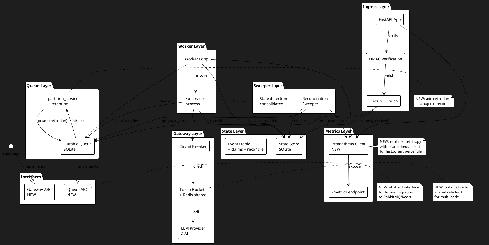
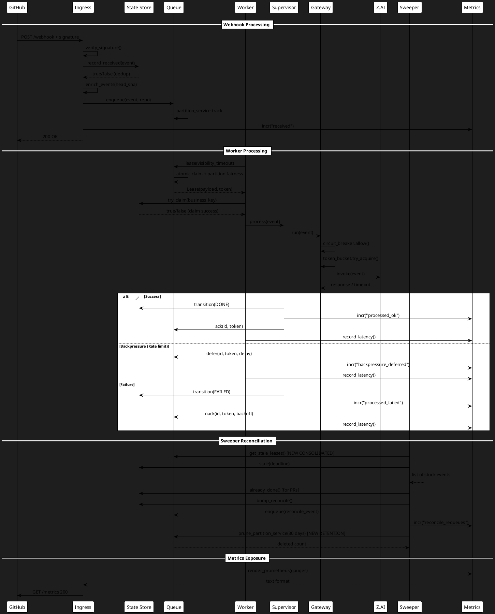
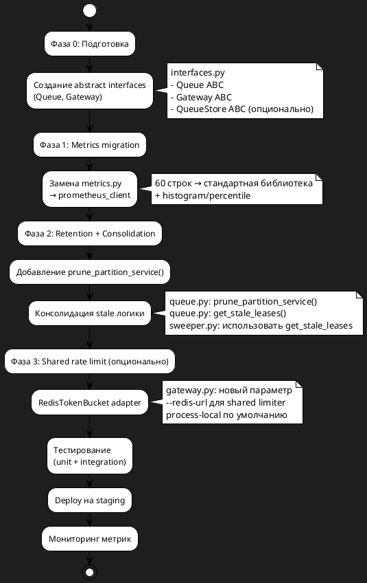

# Системные требования — FNR-1: Эволюционное улучшение reliability/

## 1. Введение

### 1.1. Общая информация

| Параметр | Значение |
|----------|----------|
| **Проект** | PR-Agent (отказоустойчивый self-hosted) |
| **Задача** | FNR-1: Ревизия reliability/ — улучшение без рискованной миграции |
| **Дата** | 2026-07-23 |
| **Статус** | Проект |
| **Приоритет** | Средний |
| **Версия документа** | 1.0 |
| **Ответственный** | System Analyst |
| **Инициатор** | Architecture Team |

### 1.2. Термины и определения

| Термин | Определение |
|--------|-------------|
| **Reliability layer** | Самостоятельный слой (~2200 строк Python) обеспечивающий надёжность обработки webhook'ов GitHub |
| **State Machine** | Машина состояний события (RECEIVED → QUEUED → PROCESSING → DONE/FAILED/DEAD_LETTER) |
| **Durable Queue** | Устойчивая очередь на SQLite с at-least-once доставкой |
| **Backpressure** | Механизм откладывания сообщения без счёта к DLQ (для rate limit) |
| **Dead-letter queue (DLQ)** | Очередь для сообщений, исчерпавших попытки обработки |
| **Partition fairness** | Механизм честного обслуживания между репозиториями |
| **Sweeper** | Фоновый процесс reconciliation — дозапуск застрявших/пропущенных событий |
| **Prometheus client** | Библиотека prometheus_client для стандартной экспозиции метрик |
| **Retention** | Механизм очистки устаревших данных |
| **Abstract interface** | Интерфейс (ABC) для будущей замены реализации |

### 1.3. Ссылки на связанные документы

| Документ | Описание |
|----------|----------|
| [`task.md`](task.md) | Постановка задачи — ревизия reliability/ |
| [`concept.md`](concept.md) | Концепты решений + вердикт дебатов |
| [`../ARCHITECTURE.md`](../ARCHITECTURE.md) | Архитектура и диагностика системы |
| [`../SYSTEM-REQUIREMENTS.md`](../SYSTEM-REQUIREMENTS.md) | Системные требования (СТ) |
| [`../SCALE-PLAN.md`](../SCALE-PLAN.md) | План масштабирования |

### 1.4. История изменений

| Версия | Дата | Автор | Изменение |
|--------|------|-------|-----------|
| 1.0 | 2026-07-23 | System Analyst | Первая версия |

---

## 2. Общее описание

### 2.1. Текущее поведение (As-Is)

#### 2.1.1. Описание текущей архитектуры

Система PR-Agent развёрнута на одном узле Dokploy и реализует self-hosted слой `reliability/` (~2198 строк Python, stdlib-only) обеспечивающий:

**Компоненты:**

```
┌─────────────────────────────────────────────────────────────────────────┐
│                         reliability/ слой                               │
├─────────────────────────────────────────────────────────────────────────┤
│  ingress.py (64) → queue.py (207) → worker.py (174)                     │
│                       ↓                                                 │
│                   state.py (294)                                        │
│                       ↓                                                 │
│              gateway.py (199) → analyze_adapter.py                      │
│                       ↓                                                 │
│                notifier.py (41) ──→ github_client.py (146)              │
│                                                                          │
│  Периодический: sweeper.py (121) ← sweeper_adapter.py (150)             │
│  Автоскейл: autoscale.py (28)                                          │
│  Метрики: metrics.py (60)                                              │
│  Безопасность: security.py (21)                                        │
└─────────────────────────────────────────────────────────────────────────┘
```

**Код-доказательство архитектуры (из ARCHITECTURE.md:129-136):**

```yaml
# Прод-docker-compose.yml поднимает три сервиса над общим SQLite-томом:
ingress:   uvicorn reliability.app:app  # webhook → queue
worker:     python -m reliability.worker # queue → process → ack/nack
sweeper:    python -m reliability.sweeper_runner  # reconciliation
```

#### 2.1.2. Ключевые компоненты и их ответственность

| Модуль | Строк | Ответственность | СТ |
|--------|-------|----------------|-----|
| `state.py` | 294 | Машина состояний, CAS-переходы, идемпотентность | СТ-2,10,11,12,13,16,28 |
| `queue.py` | 207 | Durable queue, at-least-once, DLQ, partition fairness | СТ-6..9 |
| `supervisor.py` | 80 | Оркестрация одного прохода обработки | СТ-14..16,27 |
| `gateway.py` | 199 | Circuit breaker, rate limit, failover | СТ-19..24 |
| `worker.py` | 174 | Worker loop, handle_lease, backpressure vs DLQ | СТ-14..18 |
| `sweeper.py` | 121 | Reconciliation: застрявшие→retry, PR без ревью→reconcile | СТ-13,29..32 |
| `metrics.py` | 60 | Счётчики, /metrics endpoint (Prometheus) | СТ-27б,33..35 |
| `github_client.py` | 146 | GitHub API, идемпотентный upsert комментария | СТ-25,27 |
| `webhook.py` | 83 | Парсинг GitHub webhook → Event | СТ-8 |
| `ingress.py` | 64 | HMAC, dedup, enrich, enqueue | СТ-1,2,4 |
| `notifier.py` | 41 | Видимый комментарий о провале | СТ-27 |
| `autoscale.py` | 28 | Политика числа воркеров | СТ-18 |

#### 2.1.3. Ограничения текущего решения

**Ограничение 1: Процессные метрики**
```python
# metrics.py:13-15
_counters: dict[str, int] = {}
_lock = threading.Lock()
```
- Собственная реализация счётчиков без histogram/percentile
- Отсутствие стандартных метрик (latency distribution)

**Ограничение 2: Рост partition_service**
```python
# queue.py:63-65
CREATE TABLE IF NOT EXISTS partition_service (
    partition TEXT PRIMARY KEY, last_served REAL NOT NULL
);
```
- Таблица растёт по числу репозиториев без cleanup
- Потенциально Unlimited growth

**Ограничение 3: Дублирование логики stale**
- `queue.lease` имеет poison-guard (max_attempts)
- `sweeper.stale` проверяет застрявшие события
- Логика пересекается, но не консолидирована

**Ограничение 4: Жёсткие зависимости**
- Компоненты напрямую зависят от конкретных реализаций
- Future migration (queue → RabbitMQ) требует переписи

**Ограничение 5: Процессный rate limit**
```python
# gateway.py:105-128
class TokenBucket:
    def __init__(self, rate: float, capacity: float, ...):
        self._tokens = capacity  # in-memory per process
```
- При N воркеров эффективный RPS ≈ N×rate
- Нет shared state для честного лимита

### 2.2. Архитектурное решение

**Выбранный концепт:** Concept D (Эволюционный подход) с элементами Concept A

**Обоснование (из concept.md:917-949):**
1. Система работает на одном узле — горизонтальное масштабирование не планируется в ближайшие 6 месяцев
2. Defer semantics — критичный паттерн, сохранение perfect semantics важнее сокращения строк кода
3. Проверяемые гарантии (СТ) — 107 unittest, все требования трассируемы
4. Риск/выгода соотношение — Concept B/E дают 9-22% сокращения кода ценой нарушения backpressure паттерна

**Комбинированный план:**
1. Concept A: заменить `metrics.py` → `prometheus_client` для histogram/percentile
2. Concept D:
   - Retention для `partition_service`
   - Консолидация sweeper-stale ↔ queue-redelivery
   - Abstract interfaces (`Queue`, `Gateway`) для future migration
   - Shared rate limit (Redis) для будущих multi-node воркеров

### 2.3. Диаграмма компонентов (PlantUML)



### 2.4. Схема последовательности (PlantUML)



---

## 3. План миграции

### 3.1. Этапы внедрения (PlantUML)



### 3.2. Таблица этапов

| Этап | Задачи | Критерии готовности | Rollback план | Продолжительность |
|------|--------|---------------------|---------------|------------------|
| **0. Подготовка** | - Создать `interfaces.py`<br>- Определить Queue ABC<br>- Определить Gateway ABC<br>- DurableQueue implements Queue<br>- Gateway implements Gateway | - interfaces.py создан<br>- DurableQueue имплементирует Queue<br>- Все тесты проходят | Удалить interfaces.py | 1 день |
| **1. Metrics** | - Установить prometheus_client<br>- Заменить _counter на Counter<br>- Добавить Histogram для latency<br>- Обновить /metrics endpoint | - Все unittest проходят<br>- Histogram метрики видны в Prometheus<br>- Латентность p50/p95/p95 доступна | Откатить metrics.py | 2 дня |
| **2. Retention** | - Добавить prune_partition_service()<br>- Интегрировать в sweeper<br>- Добавить get_stale_leases()<br>- Консолидировать stale логику | - Тест retention проходит<br>- partition_service не растёт<br>- sweeper использует get_stale_leases | Удалить prune/get_stale | 3 дня |
| **3. Shared limiter** | - Создать RedisTokenBucket<br>- Adapter для TokenBucket<br>- Конфигурация --redis-url | - Тест shared limiter проходит<br>- При нескольких воркерах RPS честный | Убрать --redis-url | 2 дня |
| **4. Тестирование** | - Unit тесты (107+)<br>- Integration тесты<br>- Loadtest (100k events) | - Все тесты проходят<br>- Инварианты loadtest выполняются | Воспроизвести баг | 2 дня |
| **5. Deploy** | - Deploy на staging<br>- Мониторинг 24ч<br>- Deploy на production | - Нет ошибок в логах<br>- Метрики в норме<br>- DLQ не растёт | Switch back to old code | 1 день |

### 3.3. Критерии готовности к внедрению

1. **Unit тесты:** 107+ unittest проходят (покрывают все изменённые модули)
2. **Integration:** smoke.sh проходит на реальном GitHub webhook
3. **Load test:** run_loadtest.py --events 100500 выполняет инварианты
4. **Метрики:** /metrics endpoint валиден для Prometheus
5. **РетENTION:** partition_service не растёт (>30 дней очищается)
6. **Консоляция:** sweeper использует get_stale_leases из queue

---

## 4. Функциональные требования — Backend / БД / API

### 4.1. Задача 4.1: Создание abstract interfaces для Queue и Gateway

| Метаданные | |
|-----------||
| **Ответственный за тех. реализацию** | Backend Developer |
| **Задача на разработку** | FNR-1-4.1 |
| **Jira-ссылка** | (будет создана) |

#### 4.1.1. Описание

Создать абстрактные интерфейсы для очереди и gateway, чтобы future migration на RabbitMQ/Redis была drop-in replacement без переписи бизнес-логики.

#### 4.1.2. Обоснование

Текущие компоненты (worker.py, sweeper.py) напрямую зависят от конкретных реализаций DurableQueue и Gateway. При миграции на RabbitMQ потребуется переписывать все точки вызова. Abstract interfaces позволяют:

- Заменять реализацию без изменения callers
- Тестировать с mock реализациями
- Готовиться к multi-node deployment

**Код-доказательство проблемы:**
```python
# worker.py:57
lease = queue.lease(visibility_timeout=VISIBILITY_TIMEOUT,
                    max_attempts=MAX_ATTEMPTS)
# Прямая зависимость от DurableQueue.lease
```

#### 4.1.3. Затрагиваемые компоненты

- `reliability/interfaces.py` (новый файл)
- `reliability/queue.py` (implements Queue)
- `reliability/gateway.py` (implements Gateway)
- `reliability/worker.py` (использует Queue интерфейс)
- `reliability/sweeper.py` (использует Queue интерфейс)

#### 4.1.4. Критерии приёмки

1. interfaces.py содержит Queue ABC с методами: enqueue, lease, ack, nack, defer, depth, dead_letters
2. interfaces.py содержит Gateway ABC с методом run
3. DurableQueue implements Queue (подтверждено mypy/unit test)
4. Gateway implements Gateway (подтверждено mypy/unit test)
5. worker.py использует Queue интерфейс (не DurableQueue напрямую)
6. sweeper.py использует Queue интерфейс
7. Все существующие тесты проходят (107+ unittest)

#### 4.1.5. Зависимости

- Нет (задача независима)

#### 4.1.6. Нефункциональные требования

| Параметр | Требование |
|----------|------------|
| **Type safety** | mypy passing |
| **Documentation** | Docstrings на все методы ABC |
| **Backward compat** | Existing callers не меняются |

---

### 4.2. Задача 4.2: Замена metrics.py на prometheus_client

| Метаданные | |
|-----------||
| **Ответственный за тех. реализацию** | Backend Developer |
| **Задача на разработку** | FNR-1-4.2 |
| **Jira-ссылка** | (будет создана) |

#### 4.2.1. Описание

Заменить собственную реализацию счётчиков (metrics.py) на стандартную библиотеку prometheus_client. Добавить histogram для измерения латентности.

#### 4.2.2. Обоснование

Текущая реализация:
- Не поддерживает histogram/percentile
- Отсутствует стандартная экспозиция метрик
- Требует поддержки собственного кода

**Код-доказательство (metrics.py:13-15):**
```python
_counters: dict[str, int] = {}
_lock = threading.Lock()
```

#### 4.2.3. Затрагиваемые компоненты

- `reliability/metrics.py` (полная замена)
- `reliability/app.py` (metrics endpoint)
- `requirements.txt` или `pyproject.toml` (зависимость prometheus_client)
- Все модули вызывающие metrics.incr() (без изменений API)

#### 4.2.4. Критерии приёмки

1. metrics.py использует prometheus_client.Counter, Gauge, Histogram
2. Инкремент счётчиков работает как раньше (incr(name, n))
3. Histogram метрики для latency: processing_latency_seconds, queue_lease_latency_seconds
4. /metrics endpoint возвращает валидный Prometheus format
5. Бэклог совместимость: incr(name) и incr(name, n) работают
6. Все тесты проходят (loadtest инварианты)
7. Миграция шённого состояния не требуется (счётчики in-memory)

#### 4.2.5. Метрики ( Prometheus)

| Метрика | Тип | Описание |
|---------|-----|----------|
| `reliability_processed_ok_total` | Counter | Успешно обработанные события |
| `reliability_processed_failed_total` | Counter | Сбои обработки |
| `reliability_dead_letter_total` | Counter | Сообщения в DLQ |
| `reliability_backpressure_deferred_total` | Counter | Отложенные по backpressure |
| `reliability_gateway_success_total` | Counter | Успешные вызовы gateway |
| `reliability_gateway_unavailable_total` | Counter | Сбой gateway |
| `reliability_gateway_circuit_open_total` | Counter | Circuit breaker разомкнут |
| `reliability_reconcile_requeues_total` | Counter | Sweeper requeues |
| `reliability_queue_depth` | Gauge | Глубина очереди |
| `reliability_dead_letters` | Gauge | Размер DLQ |
| `reliability_processing_latency_seconds` | Histogram | Латентность обработки (p50/p95/p99) |
| `reliability_queue_lease_latency_seconds` | Histogram | Латентность lease |

#### 4.2.6. Зависимости

- Зависит от: 4.1 (interfaces — для будущего shared limiter)
- Блокирует: 4.3 (retention — может использовать новые метрики)

#### 4.2.7. Нефункциональные требования

| Параметр | Требование |
|----------|------------|
| **Производительность** | Метрики не должны замедлять hot path (>1μs) |
| **Память** | Histogram buckets не должны раздувать память (>10MB) |
| **Совместимость** | Prometheus 2.x+ |

---

### 4.3. Задача 4.3: Retention для partition_service

| Метаданные | |
|-----------||
| **Ответственный за тех. реализацию** | Backend Developer |
| **Задача на разработку** | FNR-1-4.3 |
| **Jira-ссылка** | (будет создана) |

#### 4.3.1. Описание

Добавить механизм очистки устаревших записей из таблицы partition_service, чтобы предотвратить unlimited growth по числу репозиториев.

#### 4.3.2. Обоснование

Текущая реализация не удаляет старые partition records:
```python
# queue.py:63-65
CREATE TABLE IF NOT EXISTS partition_service (
    partition TEXT PRIMARY KEY, last_served REAL NOT NULL
);
```

При активном использовании множества репозиториев таблица растёт без ограничения.

#### 4.3.3. Затрагиваемые компоненты

- `reliability/queue.py` (метод prune_partition_service)
- `reliability/sweeper.py` (вызов prune)
- `reliability/sweeper_runner.py` (конфигурация RETENTION_DAYS)

#### 4.3.4. Критерии приёмки

1. DurableQueue.prune_partition_service(older_than_days) удаляет старые записи
2. Метод возвращает количество удалённых записей
3. Sweeper вызывает prune каждую итерацию (или по расписанию)
4. Конфигурация через RELIABILITY_PARTITION_RETENTION_DAYS (default 30)
5. Unit test: prune удаляет записи старше N дней
6. Load test: partition_service не растёт unlimited

#### 4.3.5. SQL схема

```sql
-- Добавить индекс для efficient prune
CREATE INDEX IF NOT EXISTS idx_partition_service_last_served
ON partition_service(last_served);

-- Prune query (остаётся в коде)
DELETE FROM partition_service WHERE last_served < ?
```

#### 4.3.6. Зависимости

- Зависит от: 4.1 (interfaces)
- Независима от: 4.2 (metrics)

#### 4.3.7. Нефункциональные требования

| Параметр | Требование |
|----------|------------|
| **Производительность** | Prune не должен блокировать queue.lease |
| **Retention** | Default 30 дней, конфигурируемый |

---

### 4.4. Задача 4.4: Консолидация stale логики

| Метаданные | |
|-----------||
| **Ответственный за тех. реализацию** | Backend Developer |
| **Задача на разработку** | FNR-1-4.4 |
| **Jira-ссылка** | (будет создана) |

#### 4.4.1. Описание

Консолидировать логику обнаружения застрявших сообщений: вынести get_stale_leases() в queue.py, использовать её в sweeper.py. Избежать дублирования poison-guard логики.

#### 4.4.2. Обоснование

Текущее состояние:
- queue.py имеет poison-guard (max_attempts при lease)
- sweeper.py проверяет stale события в state.py
- Логика пересекается, но не консолидирована

**Код-доказательство (queue.py:106-118):**
```python
# poison-guard: max_attempts выдач без ack → в DLQ
if max_attempts is not None and int(m["attempts"]) >= max_attempts:
    claimed_dl = self._db.execute(...)
    if claimed_dl:
        self._db.execute(
            "INSERT OR IGNORE INTO dead_letters(...)"
        )
```

#### 4.4.3. Затрагиваемые компоненты

- `reliability/queue.py` (метод get_stale_leases)
- `reliability/sweeper.py` (использовать get_stale_leases)
- `reliability/state.py` (stale method остаётся для событий)

#### 4.4.4. Критерии приёмки

1. DurableQueue.get_stale_leases(deadline_seconds) возвращает сообщения в очереди с leased_until < deadline
2. Sweeper использует get_stale_leases для сообщений в queue
3. Sweeper использует state.stale() для событий в events table
4. Unit test: get_stale_leases возвращает правильные записи
5. Дублирование poison-guard логики устранено

#### 4.4.5. SQL запросы

```sql
-- queue.get_stale_leases: сообщения в очереди с истёкшим lease
SELECT * FROM messages
WHERE leased_until IS NOT NULL
  AND leased_until < ?
  AND available_at <= ?;

-- state.stale: события вне терминала, не обновлявшиеся дольше deadline
SELECT * FROM events
WHERE state NOT IN ('done', 'dead_letter')
  AND updated_at < ?;
```

#### 4.4.6. Зависимости

- Зависит от: 4.1 (interfaces)
- Может параллельно с: 4.3 (retention)

#### 4.4.7. Нефункциональные требования

| Параметр | Требование |
|----------|------------|
| **Correctness** | Не ломать существующую stale логику в sweeper |
| **Performance** | get_stale_leaves не должен быть медленным |

---

### 4.5. Задача 4.5: Shared rate limit (опционально)

| Метаданные | |
|-----------||
| **Ответственный за тех. реализацию** | Backend Developer |
| **Задача на разработку** | FNR-1-4.5 |
| **Jira-ссылка** | (будет создана) |

#### 4.5.1. Описание

Создать Redis-based shared rate limiter для будущих multi-node воркеров. Сохранить process-local limiter как default.

#### 4.5.2. Обоснование

Текущий TokenBucket — процессный:
```python
# gateway.py:105-117
class TokenBucket:
    def __init__(self, rate: float, capacity: float, ...):
        self._tokens = capacity  # in-memory per process
```

При N воркерах эффективный RPS ≈ N×rate, что может превышать лимит Z.AI.

#### 4.5.3. Затрагиваемые компоненты

- `reliability/gateway.py` (RedisTokenBucket adapter)
- `reliability/worker.py` (конфигурация --redis-url)
- `requirements.txt` или `pyproject.toml` (зависимость redis)

#### 4.5.4. Критерии приёмки

1. RedisTokenBucket implements TokenBucket interface
2. Атомарная операция try_acquire через Lua script
3. Конфигурация через RELIABILITY_REDIS_URL (опционально)
4. При отсутствии REDIS_URL используется process-local limiter
5. Unit test: shared limiter честен между процессами
6. Integration test: Redis connection failure fallback to process-local

#### 4.5.5. Lua script (atomic)

```lua
-- redis_token_bucket.lua
local key = KEYS[1]
local now = tonumber(ARGV[1])
local rate = tonumber(ARGV[2])
local capacity = tonumber(ARGV[3])
local cost = tonumber(ARGV[4] or 1)

local bucket = redis.call('HMGET', key, 'tokens', 'last')
local tokens = tonumber(bucket[1]) or capacity
local last = tonumber(bucket[2]) or now

local delta = now - last
tokens = math.min(capacity, tokens + delta * rate)

if tokens >= cost then
    tokens = tokens - cost
    redis.call('HMSET', key, 'tokens', tokens, 'last', now)
    redis.call('EXPIRE', key, math.ceil(capacity / rate) + 60)
    return 1
else
    redis.call('HMSET', key, 'tokens', tokens, 'last', now)
    redis.call('EXPIRE', key, math.ceil(capacity / rate) + 60)
    return 0
end
```

#### 4.5.6. Зависимости

- Зависит от: 4.1 (interfaces), 4.2 (metrics)
- Опционально: может быть отложена

#### 4.5.7. Нефункциональные требования

| Параметр | Требование |
|----------|------------|
| **Атомарность** | try_acquire атомарный (Lua script) |
| **Fallback** | Redis недоступен → process-local |
| **Производительность** | < 1ms на try_acquire |

---

## 5. Требования к интерфейсам — Frontend / UI

**Не применимо** — данный проект не содержит UI-изменений. Все задачи касаются backend-логики, БД и API.

---

## 6. Ревью требований

| Роль | Имя | Статус | Комментарии |
|------|-----|--------|-------------|
| **Аналитик** | System Analyst | ✓ | Документ готов |
| **Разработчик Backend** | (будет назначен) | - | Требуется review кода |
| **Разработчик Frontend** | (не применимо) | - | - |
| **Тестирование** | QA Engineer | - | Требуется review test plan |

---

## 7. Риски и ограничения

### 7.1. Таблица рисков

| ID | Риск | Вероятность | Влияние | Митигация |
|----|------|-------------|----------|-----------|
| **R-1** | prometheus_client добавляет зависимость | Низкая | Низкое | Стабильная библиотека, широко используется |
| **R-2** | Retention может удалить активные partition'ы | Низкая | Среднее | Консервативный default (30 дней), тесты |
| **R-3** | Консолидация stale логики сломает sweeper | Средняя | Высокое | Comprehensive unit+integration тесты |
| **R-4** | Redis dependency для shared limiter | Средняя | Среднее | Fallback к process-local, опционально |
| **R-5** | Abstract interfaces усложняют код | Низкая | Низкое | Простые ABC, документация |
| **R-6** | Histogram метрики раздуют память | Низкая | Низкое | Ограничить buckets, мониторинг |
| **R-7** | Load test не покрывает новые фичи | Средняя | Среднее | Обновить loadtest для проверки retention/stale |

### 7.2. Ограничения

1. **Одиночный узел** — все улучшения в рамках одного узла Dokploy
2. **SQLite как БД** — никаких миграций на Postgres в этом проекте
3. **Backward compat** — требуется совместимость с существующими deployment
4. **Stdlib-only (кроме prometheus_client)** — минимизировать зависимости
5. **No breaking changes** — все API остаются совместимыми

---

## 8. Приложения

### 8.1. SQL-скрипты

#### Retention для partition_service

```sql
-- Добавить индекс для efficient prune
CREATE INDEX IF NOT EXISTS idx_partition_service_last_served
ON partition_service(last_served);

-- Prune query (остаётся в коде queue.py)
DELETE FROM partition_service WHERE last_served < ?;
```

### 8.2. Interfaces (черновик)

```python
# reliability/interfaces.py
from __future__ import annotations
from abc import ABC, abstractmethod
from dataclasses import dataclass
from typing import Optional

@dataclass(frozen=True)
class Lease:
    id: int
    partition: str
    payload: dict
    attempts: int
    token: str

class Queue(ABC):
    @abstractmethod
    def enqueue(self, payload: dict, partition: str, *, delay: float = 0) -> int: ...

    @abstractmethod
    def lease(self, *, visibility_timeout: float,
              max_attempts: Optional[int] = None) -> Optional[Lease]: ...

    @abstractmethod
    def ack(self, message_id: int, token: str) -> bool: ...

    @abstractmethod
    def nack(self, message_id: int, token: str, *, max_attempts: int,
             backoff: float = 0, reason: str = "nack") -> str: ...

    @abstractmethod
    def defer(self, message_id: int, token: str, *, delay: float) -> str: ...

    @abstractmethod
    def depth(self) -> int: ...

    @abstractmethod
    def dead_letters(self) -> list: ...

    @abstractmethod
    def prune_partition_service(self, older_than_days: int = 30) -> int: ...

    @abstractmethod
    def get_stale_leases(self, deadline_seconds: float) -> list: ...

class Gateway(ABC):
    @abstractmethod
    def run(self, event: Event) -> None: ...
```

### 8.3. Маппинг метрик

| Старая метрика | Новая метрика | Тип |
|----------------|---------------|-----|
| `processed_ok` | `reliability_processed_ok_total` | Counter |
| `processed_failed` | `reliability_processed_failed_total` | Counter |
| `dead_letter_total` | `reliability_dead_letter_total` | Counter |
| `backpressure_deferred` | `reliability_backpressure_deferred_total` | Counter |
| `gateway_success` | `reliability_gateway_success_total` | Counter |
| `gateway_unavailable` | `reliability_gateway_unavailable_total` | Counter |
| `gateway_circuit_open` | `reliability_gateway_circuit_open_total` | Counter |
| `reconcile_requeues` | `reliability_reconcile_requeues_total` | Counter |
| `queue_depth` (gauge) | `reliability_queue_depth` | Gauge |
| `dead_letters` (gauge) | `reliability_dead_letters` | Gauge |
| — | `reliability_processing_latency_seconds` | Histogram |
| — | `reliability_queue_lease_latency_seconds` | Histogram |

### 8.4. Шпаргалка по stale логике

| Локация | Что проверяет | SQL |
|---------|----------------|-----|
| `queue.lease` | max_attempts при выдаче | poison-guard → DLQ |
| `queue.get_stale_leases` | leased_until < deadline | Сообщения в очереди |
| `state.stale` | updated_at < deadline, state NOT IN terminal | События в events table |

---

**Документ завершён. Следующий шаг:** `/validate-doc sa_documentation/FNR/FNR_1/system_requirements.md`
