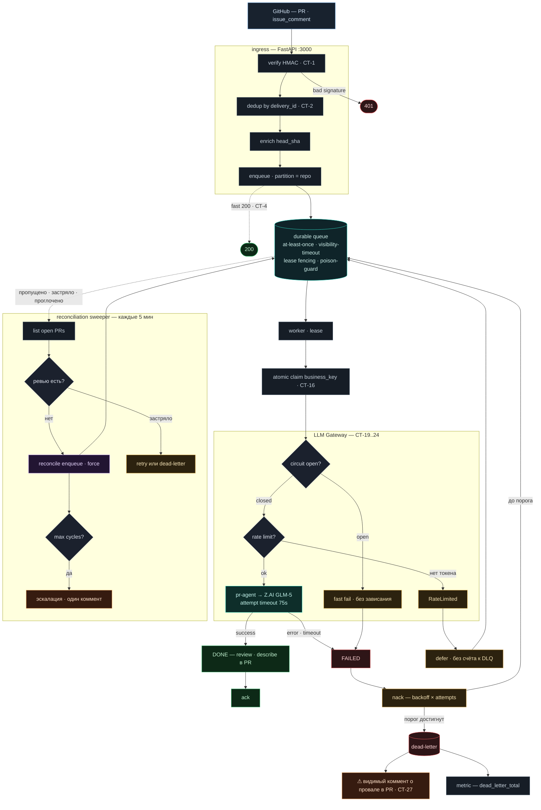
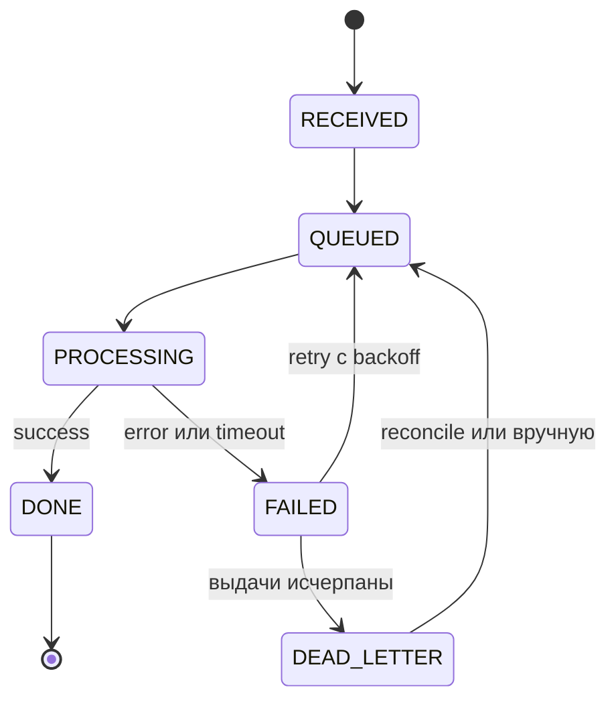

# Архитектура и диагностика — отказоустойчивый PR-Agent (issue #1)

Как устроен конвейер и **как чинить при сбоях**. Рассчитано и на людей, и на
ИИ-агента: диаграммы + плейбук «симптом → причина → как подтвердить → фикс».

Цель системы — **«не молчать»**: любой сбой или зависание Z.AI становится видимым
комментарием в PR, а не тишиной. Контракт — SLO (К-1..К-5), не «нулевые ошибки».

- Процедура go-live / откат: [`GO-LIVE.md`](GO-LIVE.md)
- Требования и трассировка СТ↔К: [`SYSTEM-REQUIREMENTS.md`](SYSTEM-REQUIREMENTS.md)
- План масштабирования (100k/сутки): [`SCALE-PLAN.md`](SCALE-PLAN.md)
- Код и модули: [`reliability/README.md`](reliability/README.md)

---

## 1. Полный жизненный цикл события

Webhook отвечает мгновенно (`200`), работа идёт в durable-очереди и воркере.
Красным помечено, где система «не молчит»: провал всегда доходит до комментария в PR.



**Легенда цветов:** бирюза — happy path (анализ) · зелёный — DONE (опубликовано) ·
янтарь — retry / backpressure · красный — FAILED / dead-letter · оранжевый — alert
(коммент в PR) · фиолетовый — reconcile (дозапуск).

---

## 2. Машина состояний события (СТ-10..13)

Строгий граф с CAS-защитой от гонок. Терминалы — только `DONE` и `DEAD_LETTER`;
застрять «между» нельзя (за этим следит sweeper).



---

## 3. Контракт надёжности (К-1..К-5)

| Код | Гарантия | Чем обеспечена |
|---|---|---|
| **К-1** | Нет тихих падений | Любой провал → dead-letter → видимый коммент в PR (СТ-27) + метрика |
| **К-2** | Гарантированное eventual-завершение | Reconciliation sweeper дозапускает пропущенное/застрявшее |
| **К-3** | p95 «событие → ревью» < 10 мин | attempt-таймаут 75с + circuit breaker против зависаний Z.AI |
| **К-4** | Идемпотентность | dedup по `delivery_id` + атомарный claim + idempotent upsert |
| **К-5** | Наблюдаемость | `/metrics` (Prometheus) + `/health` наружу |

---

## 4. Компоненты (три процесса на общем томе)

Прод-`docker-compose.yml` поднимает три сервиса поверх одного SQLite-тома `/data`:

| Сервис | Команда | Роль |
|---|---|---|
| **ingress** | `uvicorn reliability.app:app` | приём webhook, HMAC, dedup, enrich, enqueue. Пути `/webhook` (+ легаси `/api/v1/github_webhooks`), `/health`, `/metrics` |
| **worker** | `python -m reliability.worker` | очередь → atomic claim → LLM Gateway → pr-agent → ack/nack; при DLQ — коммент в PR |
| **sweeper** | `python -m reliability.sweeper_runner` | раз в `RELIABILITY_SWEEP_INTERVAL` сверяет открытые PR, дозапускает, эскалирует |

**Где лежит состояние** (для диагностики через SQLite):
- `/data/reliability.db` → таблицы `events` (состояние+attempts), `claims` (захваты бизнес-ключа), `reconcile` (счётчик циклов).
- `/data/queue.db` → таблицы `messages` (очередь), `dead_letters`, `partition_service`.

---

## 5. Плейбук диагностики — «как починить»

> Начинай всегда с `docker compose ps`, `docker compose logs -f worker sweeper ingress`
> и `curl -s http://<host>:3000/metrics`. Метрики (`reliability_*`) — главный сигнал.
> Смоук-скрипт: [`scripts/smoke.sh`](scripts/smoke.sh).

| Симптом | Вероятная причина | Как подтвердить | Фикс |
|---|---|---|---|
| На PR не появляется ревью | worker не запущен / webhook не доходит / Z.AI лежит | `metrics`: `processed_ok` не растёт, `queue_depth` растёт; GitHub App → Recent Deliveries; logs ingress | Поднять worker; проверить доставку webhook (redeliver); проверить `OPENAI_KEY`/`OPENAI_API_BASE` |
| В PR повторяется коммент о провале; `dead_letter_total` растёт | реальный сбой попытки (пока цепь ЗАМКНУТА): неверный ключ Z.AI, таймаут, дефект PR | Класс сбоя прямо в комменте (`TimeoutError` / `ValueError` / `GatewayUnavailable`); `metrics`: `gateway_provider_failure`, `gateway_unavailable` | Починить ключ/endpoint/лимит Z.AI. После починки sweeper дозапустит; или вручную `/review`. Массовый дедлетер по всему бэклогу при аутейдже больше не возникает — при разомкнутой цепи PR ОТКЛАДЫВАЮТСЯ (ниже) |
| `queue_depth` растёт (бэклог) | воркер не успевает / RPS занижен / Z.AI медленный | `metrics`: `queue_depth` ↑, `processed_ok` медленно | Поднять реплики воркера (см. `autoscale.desired_workers`); поднять `RELIABILITY_LLM_RPS` (с учётом лимит/реплик) |
| Ничего не обрабатывается, `backpressure_deferred` растёт | rate limit занижен (`RPS`/`BURST` слишком малы) | `metrics`: `backpressure_deferred` ↑, `gateway_success` стоит | Поднять `RELIABILITY_LLM_RPS` и `RELIABILITY_LLM_BURST` |
| Пусто, `gateway_circuit_open` / `gateway_circuit_deferred` растёт | circuit breaker разомкнут — Z.AI лежит; PR при этом ОТКЛАДЫВАЮТСЯ (backpressure), не дедлетерятся | `metrics`: `gateway_circuit_open` ↑, `gateway_circuit_deferred` ↑, `backpressure_deferred` ↑ | Дождаться/починить Z.AI — breaker сам закроется после успешной пробы (`RELIABILITY_CB_RESET`), отложенный бэклог до-разберётся. «Не молчать» на затяжной простой — эскалация свипера после `max_cycles` (один коммент на PR) |
| Дублирующееся ревью/коммент | несколько узлов на РАЗНЫХ томах (claim/queue не общие) | два инстанса пишут в разные `/data` | Держать один узел/том; для мультиузла — общий Redis/очередь (см. §6) |
| Sweeper падает/рестартует (`installation lookup failed` / `HTTP Error 401` на `/repos/.../installation`) | в `RELIABILITY_REPOS` указан точный `owner/repo`, которого нет или App к нему не имеет доступа | logs sweeper (traceback) | Исправить/убрать репо; для всей орг проще маска `owner/*` (`po-helper-org/*,ai-oxudevelopment/*`) — несуществующий owner маску не роняет |
| Sweeper не дозапускает пропущенное по орг (но не падает) | App не установлен на owner маски → маска раскрывается в пусто | logs sweeper; GitHub App → Installations | Установить App на owner (Install → All repositories); перезапустить sweeper |
| Событие «застряло» вне терминала | воркер умер в PROCESSING; захват завис | SQLite-запрос ниже | Ничего не делать — sweeper (`RELIABILITY_STALE_DEADLINE`) передоставит; захват самозалечивается на терминале |

**Быстрые SQLite-запросы (внутри контейнера, `/data`):**

```sql
-- события вне терминала (потенциально застрявшие)
SELECT delivery_id, state, attempts, updated_at
FROM events WHERE state NOT IN ('done','dead_letter') ORDER BY updated_at;

-- что ушло в dead-letter и почему (queue.db)
SELECT id, partition, attempts, reason, dead_at FROM dead_letters ORDER BY dead_at DESC;

-- текущие захваты бизнес-ключей (при подозрении на блокировку)
SELECT business_key, delivery_id, updated_at FROM claims;

-- глубина очереди и «возраст» бэклога (queue.db)
SELECT COUNT(*) AS depth, MIN(available_at) AS oldest FROM messages;
```

**Откат на прежний «голый» pr-agent** (если стек нездоров):
```bash
docker compose down
docker compose -f docker-compose.legacy-pr-agent.yml up -d --build
```
Данные (`reliability-data`) сохраняются — можно вернуться на новый стек позже.

---

## 6. Ограничения (учитывать на масштабе)

- **Один узел Dokploy.** Очередь и состояние — SQLite (durable в пределах узла).
  Несколько узлов одновременно — заменить очередь/лимитер на Redis за тем же интерфейсом.
- **Circuit breaker и rate limit — процессные** (in-memory на реплику). При N воркерах
  суммарный RPS ≈ N×`RELIABILITY_LLM_RPS`; размыкание цепи независимо на каждой реплике.
  Задавать `RELIABILITY_LLM_RPS ≈ (лимит Z.AI) / (макс. реплик)`.
- **Один ключ Z.AI** — кросс-провайдерного резерва нет; gateway готов принять доп.
  провайдеров (`Provider(...)` в `worker.main`), когда появится второй ключ/эндпоинт.
- **Алерты** — пока только видимый коммент в PR + `/metrics`. Интеграция healthchecks.io
  — отдельный issue (осознанно отложено).

---

## 7. Для ИИ-агента: инварианты (не ломать)

Перед правкой прогнать тесты: `cd self-hosted && python3 -m unittest discover -s reliability/tests -t .`
(140 unittest, stdlib-only). Ключевые инварианты:

- **`visibility_timeout` (120) > `task_timeout` (90) > `attempt_timeout` (75).** Воркер
  бросает задачу раньше, чем очередь передоставит — иначе двойная конкурентная обработка.
- **`process`/`schedule` остаются `sync`.** `_real_invoke` делает `asyncio.run`; `async def`
  сломает его.
- **Захват бизнес-ключа самозалечивается на терминале** (`state.try_claim` перехватывает
  захват, чей держатель `DONE`/`DEAD_LETTER`); плюс явный `release_claim` на dead-letter.
  Не превращать в вечную блокировку.
- **Backpressure (`state.Backpressure`/`RateLimited`) ≠ FAILED.** Воркер `defer`-ит без
  счёта к DLQ и без коммента; не помечать как провал.
- **`enrich_events` — до `record_received`** (business_key зависит от head_sha).
- **Все интеграции инъектируются**; реальные HTTP/crypto-обёртки — `pragma: no cover`,
  проверяются на живом смоуке, а не в unit-тестах.
- **Идемпотентность публикации** — только через `github_client.upsert_comment` (маркер
  `<!-- reliability:... -->`), не постить комменты напрямую.
