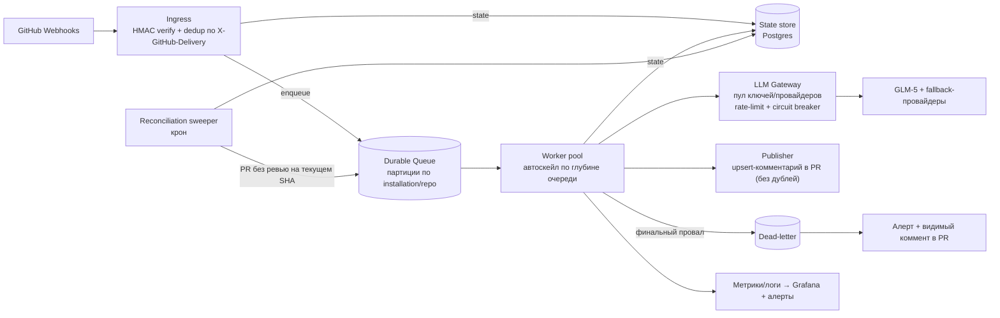

# PR-Agent как ядро платформы — план стабилизации и масштабирования

> Цель: превратить текущий одиночный webhook-контейнер PR-Agent (GLM-5 / Z.AI) в
> отказоустойчивое ядро, обрабатывающее **до 100 000 Issue/PR-событий в сутки**
> **без тихих падений**. Развитие поэтапное (StepByStep), каждый этап с
> проверяемым критерием выхода — без big-bang переписывания работающей системы.

---

## 0. Контракт надёжности (что именно гарантируем)

«Обрабатывать всё без ошибок» как абсолют недостижимо: LLM-провайдер, GitHub API и
сеть периодически недоступны. Поэтому фиксируем реальный, но строгий контракт —
именно он и есть цель платформы:

| Свойство | Формулировка |
|---|---|
| Нет тихих падений | 100% событий приходят в наблюдаемое терминальное состояние: `done` либо `dead-letter` + алерт + видимый комментарий в PR |
| Гарантированное завершение | каждое валидное событие ретраится до успеха или эскалируется; ничто не теряется молча |
| Ограниченная задержка | SLO: p95 время «событие → ревью опубликовано» < 10 мин под целевой нагрузкой |
| Идемпотентность | at-least-once доставка + идемпотентный эффект: повторная обработка не плодит дублей ревью |
| Наблюдаемость | у каждого события есть строка состояния, метрики и трассировка от приёма до публикации |

Формально это набор **SLO + алертов**, а не обещание «нулевых ошибок». Ошибки
допустимы — недопустима их **невидимость** и **невосстановимость**.

---

## 1. Почему текущая архитектура не тянет 100k/сутки

Сейчас: один контейнер, webhook отвечает `200` мгновенно, работа уходит в
`BackgroundTask` внутри того же процесса; при исключении в LLM-вызове pr-agent
**пишет его в лог и ничего не постит**. Узкие места:

- **Нет очереди/персистентности:** рестарт контейнера или падение воркера = событие потеряно навсегда.
- **Тихий провал:** исключение LLM не доходит ни до PR, ни до вас.
- **Нет ретраев/реального fallback:** `fallback_models` = та же модель и тот же ключ.
- **Связка воркера и провайдера:** нагрузка на GLM-5 идёт напрямую, без пула ключей и rate-limit — 429 гарантированы уже на десятках событий.
- **Не горизонтально масштабируется:** один процесс, состояние в памяти.

Прикидка масштаба (для калибровки, не точный расчёт):
100k событий × ~5 LLM-вызовов (describe многозвонковый + review + improve) ≈
**~500k LLM-вызовов/сутки** и **~500k GitHub API-вызовов/сутки**. При длительности
reasoning-вызова ~30 c нужна средняя конкурентность ~150–200, пиковая 500–900
одновременных вызовов. Ни один одиночный ключ и ни один контейнер это не выдержат.

---

## 2. Целевая архитектура

Компоненты:

- **Ingress (stateless, за LB):** проверяет HMAC, дедуп по `X-GitHub-Delivery`, пишет событие в очередь и состояние в БД, возвращает `200` быстро. Ничего тяжёлого.
- **Durable queue** (Redis Streams / RabbitMQ / SQS / Kafka): ретраи, visibility-timeout, DLQ, backpressure; **партиции по installation/repo** для честности и порядка.
- **Worker pool (stateless, автоскейл):** тянет событие → запускает анализ pr-agent (describe/review/improve) с per-task таймаутом → `done` или ретрай → после N попыток DLQ.
- **LLM Gateway** (LiteLLM Router/Proxy или аналог): **пул ключей и провайдеров**, per-key token-bucket, ретраи, circuit breaker, failover, кэш идентичных промптов, тиринг моделей (лёгкая на describe, тяжёлая на review — см. риск стоимости).
- **State store (Postgres):** машина состояний события (`received → queued → processing → done/failed/dead-letter`), попытки, timestamps, `head_sha`. Основа идемпотентности, reconciliation и дашбордов.
- **Publisher:** публикует результат **upsert-ом** (правит существующий бот-коммент по инструменту, а не плодит новые) — идемпотентный эффект.
- **Reconciliation sweeper (крон):** сверяет открытые PR с БД; PR, у которого на текущем `head_sha` нет завершённого ревью, → повторно в очередь. Ловит пропущенные вебхуки, упавших воркеров, аутейджи провайдера. **Это и есть движок «гарантированности».**
- **Observability + alerting:** метрики (глубина очереди, latency, success-rate, LLM 429/ошибки, размер DLQ) → Grafana; алерты (DLQ>0, success<X%, p95>Y, circuit open) → on-call.

---

## 3. Жёсткие потолки и риски (честно, до начала работ)

Это не «баги», а внешние ограничения — их надо закладывать в дизайн, иначе
масштаб упрётся раньше нашего кода:

1. **GitHub API rate limits — вероятно, первый потолок.** У GitHub App лимит масштабируется с числом установок (от 5 000 до ~15 000 req/hr) + вторичные лимиты на конкурентность. ~500k API-вызовов/сутки ≈ 20k/hr — уже выше даже 15k/hr. Митигация: минимизация вызовов + условные запросы (ETag-кэш), шардирование по нескольким App/installations, при необходимости GitHub Enterprise. **Проверить лимиты до Фазы 4.**
2. **Пропускная способность и стоимость LLM.** ~500k reasoning-вызовов/сутки одного ключа Z.AI не осилит и это дорого. Нужны: пул ключей/провайдеров, провиженные лимиты, **кэш идентичных диффов**, **тиринг моделей** (дешёвая на describe, тяжёлая на review — прямой аналог вашей идеи #112). Бюджет и квоты — явная статья.
3. **«Ровно один раз» невозможно** — только «хотя бы один раз + идемпотентный эффект». Дизайним upsert-комментарии и dedup по delivery-id + head_sha.
4. **Честность/безопасность содержимого:** тела Issue/PR — недоверенный ввод от кого угодно, кто может писать в репо. На масштабе — обязательная защита от prompt-инъекций в промптах ревью.

---

## 4. План StepByStep

Каждая фаза самодостаточна, деплоится отдельно и имеет **проверяемый критерий
выхода**. Ценность растёт монотонно: даже остановившись на Фазе 3, вы получаете
«гарантированное eventual-завершение без тихих падений» на умеренном масштабе.

### Фаза 0 — Стабилизировать текущий узел (дни)
- **Цель:** убрать тихие зависания на нынешнем одиночном контейнере.
- **Изменения:** `ai_timeout` 120→45 c; litellm-ретраи с backoff; реальный кросс-провайдерный `fallback_models` (второй ключ/провайдер); снизить всплеск (`async_ai_calls=false`, `max_ai_calls=2`, `/improve` — не в авто, `handle_push_trigger=false`); Docker healthcheck + автоперезапуск; внешний heartbeat (dead-man switch) с алертом.
- **Критерий выхода:** искусственный таймаут провайдера → вызов падает за <60 c, не виснет; контейнер, зависнув, рестартится healthcheck'ом; вы получаете алерт при простое.
- **Итог:** «не виснет молча» здесь и сейчас, без смены архитектуры.

### Фаза 1 — Наблюдаемость и идемпотентность (before scaling)
- **Цель:** нельзя масштабировать то, что не видно; нельзя ретраить без dedup.
- **Изменения:** структурные логи; State store (старт с Postgres); запись каждого события по `X-GitHub-Delivery` + `head_sha`; дедуп повторных доставок; эндпоинт метрик (глубина, latency, success-rate).
- **Критерий выхода:** у каждого принятого события есть строка состояния; повторная доставка того же delivery-id не запускает вторую обработку; дашборд показывает поток.
- **Итог:** фундамент для очереди, ретраев и reconciliation.

### Фаза 2 — Расцепление: очередь + разделение ingress/worker
- **Цель:** пережить падение/рестарт без потери события.
- **Изменения:** разбить контейнер на **ingress** (webhook→очередь, быстрый `200`) и **worker** (очередь→pr-agent); durable queue (Redis Streams как минимум); at-least-once + visibility-timeout + ретраи + **DLQ**.
- **Критерий выхода:** kill воркера в середине задачи → задача передоставляется и завершается; принудительный провал N раз → уходит в DLQ (не теряется).
- **Итог:** сбой воркера больше не равен потере события.

### Фаза 3 — Гарантии надёжности (ядро контракта)
- **Цель:** «гарантированное eventual + никогда не молча».
- **Изменения:** политика ретраев с backoff; LLM Gateway (LiteLLM Router/Proxy) с кросс-провайдерным failover + circuit breaker; **DLQ-handler постит видимый коммент в PR + шлёт алерт**; **reconciliation sweeper** дозапускает PR без ревью на текущем SHA; upsert-публикация (без дублей).
- **Критерий выхода:** симулируем аутейдж провайдера → события ретраятся, после восстановления reconcile добивает все PR, алерт был отправлен, дублей ревью нет, тихой потери — ноль.
- **Итог:** контракт из §0 выполнен на умеренном масштабе (тысячи/сутки).

### Фаза 4 — Горизонтальное масштабирование
- **Цель:** довести до целевой пропускной способности.
- **Изменения:** оркестрация с автоскейлом воркеров по глубине очереди (k8s HPA/KEDA либо масштабирование Dokploy-сервиса); **LLM Gateway с пулом ключей/провайдеров** + per-key token-bucket; **GitHub API-клиент с учётом rate-limit** (ETag-кэш, минимизация вызовов, при нужде шардирование по нескольким App); нагрузочное тестирование до цели.
- **Критерий выхода:** устойчивый нагрузочный тест на целевом rps держит SLO (p95<10 мин, success≥99.9%); при 429/circuit-open деградация мягкая (очередь копит, не теряет).
- **Итог:** платформа держит целевые 100k/сутки.

### Фаза 5 — Харденинг под роль ядра
- **Цель:** пригодность как критичного ядра платформы.
- **Изменения:** формализовать SLO + алерты + on-call; chaos-тесты (kill воркеров, blackhole провайдера, backpressure очереди); контроль стоимости (кэш, тиринг моделей, бюджеты/квоты); честность/квоты по тенантам (один шумный репо не голодит остальных); защита от prompt-инъекций; DR/бэкапы состояния; runbooks.
- **Критерий выхода:** chaos-учения проходят без тихих потерь; стоимость в бюджете; честность под noisy-neighbor держится.
- **Итог:** ядро, которому можно доверить платформу.

---

## 5. Ключевые решения (нужен ваш выбор — влияют на детали, не на структуру)

1. **Инфра-платформа:** остаёмся на Dokploy (проще, но автоскейл ограничен) или переходим на Kubernetes (сложнее, но нативный HPA/KEDA — нужен для Фазы 4)?
2. **Очередь:** Redis Streams (минимум зависимостей) / RabbitMQ / managed SQS / Kafka (если нужен большой ретеншн и партиционирование)?
3. **LLM Gateway:** self-host LiteLLM Proxy (контроль, бесплатно) или managed (Portkey и т.п.)?
4. **Резерв LLM:** есть ли второй провайдер/ключ, кроме Z.AI GLM-5? Без него Фаза 3 даёт только «ретрай+reconcile», без переживания аутейджа провайдера.
5. **Канал алертов:** Telegram / PagerDuty / e-mail / healthchecks.io (dead-man switch)?
6. **pr-agent: библиотека или сервис?** Оставляем pr-agent как анализатор внутри воркера (быстрее стартуем) или со временем заменяем своим воркером, вызывающим его как библиотеку (больше контроля на масштабе)?

---

## 6. SLO и алерты (целевые значения — уточнить под нагрузку)

| Метрика | Цель | Алерт |
|---|---|---|
| Доля событий, дошедших до терминального состояния | 100% | любое «застряло» > 30 мин |
| p95 latency «событие → ревью» | < 10 мин | p95 > 15 мин |
| Success-rate обработки | ≥ 99.9% (с ретраями) | < 99% за 15 мин |
| Размер DLQ | 0 в норме | > 0 → немедленный алерт + коммент в PR |
| LLM 429 / circuit-open | близко к 0 | всплеск 429 или открытый circuit |
| Глубина очереди | стабильна | рост без спада 15 мин (backpressure) |

---

## 7. Рекомендуемый минимум для старта

Начать с **Фаз 0 → 1 → 2 → 3** — это уже даёт полный контракт §0 (гарантированное
eventual-завершение, ноль тихих падений) на масштабе тысяч событий/сутки, без
k8s и без пула провайдеров. Фазы 4–5 подключаем, когда реальный поток пойдёт
к десяткам тысяч в сутки и упрёмся в потолки §3.
