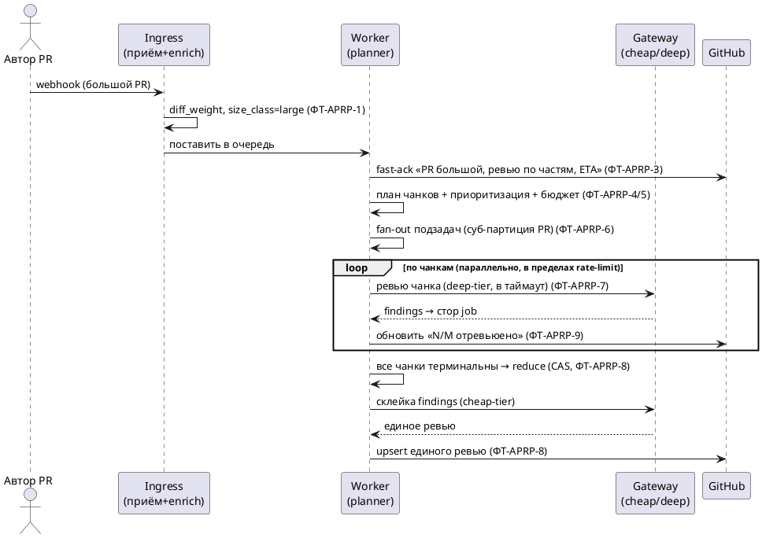
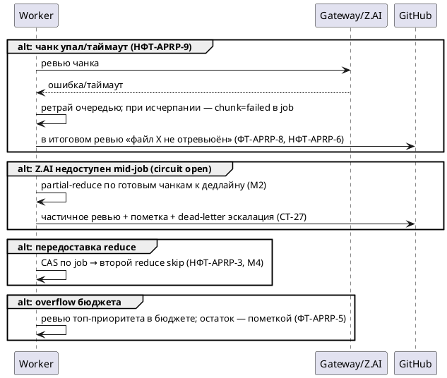

# [БФТ] APRP: Адаптивная обработка PR по размеру диффа

> Стадия 4 pipeline (Requirements Writer). Черновик из концепта A + модификаций
> M1–M6 (дебаты). Каждое требование ← источник (S1–S10 из context-pack; СТ-* из
> `SYSTEM-REQUIREMENTS.md`; PO — kibarik, 2026-07-18). Неподтверждённые числа —
> `предв. [УТОЧНИТЬ]`. Ожидает стадию 5 (`/bft-validate`).

## 1. Контекст и цель

Self-hosted PR-Agent (Qodo, GLM-5 через Z.AI) ревьюит PR одним проходом независимо
от размера диффа. На больших PR один вызов GLM-5 не укладывается в таймаут и
деградирует по качеству (инцидент `litellm.Timeout 90→271.79с`, `[S1]`). Цель эпика —
**адаптивная обработка по размеру**: малые PR — как есть; большие — с быстрой
первичной ОС и map-reduce обработкой, чтобы GLM-5 держала качество, а автор не видел
тишины.

## 2. Границы системы

**ВНУТРИ:** классификация размера диффа; маршрутизация small/large; первичное
оповещение (fast-ack); разбиение большого диффа на чанки, параллельное ревью,
идемпотентный синтез единого ревью; тиринг моделей; инкрементальная публикация
прогресса; бюджет/приоритизация чанков; кэш ревью по blob-sha (опц.); правка
вложенности таймаутов и отключение внутренних ретраев litellm.

**СНАРУЖИ:** промпты pr-agent/Qodo (используются как есть); хостинг, латентность и
лимиты моделей Z.AI; GitHub API rate-limit (учитывается, не управляется);
инфраструктура Dokploy. Система **не** меняет саму логику генерации ревью pr-agent и
**не** заменяет провайдера LLM.

## 3. Акторы

| Актор | Описание |
|---|---|
| Автор PR | Открывает/пушит PR, потребитель ревью и первичной ОС |
| GitHub App (`infra-dos-assistant-*`) | Источник webhook, публикатор комментов |
| Ingress / Worker / Sweeper | Слой надёжности: приём, очередь, обработка, реконсиляция `[S3,S4]` |
| LLM Gateway | Маршрутизация к моделям, тиринг, rate-limit, circuit breaker `[S5]` |
| Cheap-tier модель (**GLM-4.7**) | Лёгкие операции: триаж, fast-ack, склейка (PO Q3) |
| Deep-tier (**GLM-5**/Z.AI) | Глубокое ревью приоритетных чанков |

## 4. Бизнес-требования (БТ)

| Идентификатор | Наименование | Ценность | Краткое описание | Связанные |
|---|---|---|---|---|
| БТ-APRP-1 | Ревью больших PR доходит до автора | Устранение «немого» отказа на больших PR (P1/P2) | Большой PR получает полноценное ревью без таймаута | ПТ-APRP-1, ФТ-APRP-4..8, НФТ-APRP-2 |
| БТ-APRP-2 | Ранняя прозрачность ожидания | Доверие: автор сразу знает, что PR принят и почему дольше | Первичная ОС с нулевой секунды | ПТ-APRP-2, ФТ-APRP-3, НФТ-APRP-1 |
| БТ-APRP-3 | Высокое качество ревью на объёме | Ценность ревью не падает с ростом диффа (P3) | Фокусные вызовы + синтез вместо одного размытого прохода | ПТ-APRP-1, ФТ-APRP-5..7, НФТ-APRP-6 |
| БТ-APRP-4 | Экономная и предсказуемая стоимость | Не жечь квоту Z.AI впустую (P4), укладываться в бюджет | Бюджет/приоритизация чанков, отказ от двойного ретрая | ФТ-APRP-9, ФТ-APRP-11, НФТ-APRP-5 |

Все БТ → эпик `[УТОЧНИТЬ ключ]`.

## 5. Пользовательские требования (ПТ)

| Идентификатор | Наименование | Story | Связанные |
|---|---|---|---|
| ПТ-APRP-1 | Ревью большого PR | **Когда** я (автор) пушу большой PR, **Я хочу** получить полноценное ревью, **Чтобы** не открывать его вручную по кускам | БТ-APRP-1, БТ-APRP-3 |
| ПТ-APRP-2 | Знать, что PR принят | **Когда** мой PR большой, **Я хочу** сразу видеть «принято, ревью по частям, ~ETA», **Чтобы** не гадать, работает ли бот | БТ-APRP-2 |
| ПТ-APRP-3 | Видеть прогресс | **Когда** ревью идёт по частям, **Я хочу** видеть прогресс (N/M), **Чтобы** понимать, сколько осталось | БТ-APRP-2 |
| ПТ-APRP-4 | Честный результат при сбое | **Когда** часть файлов не удалось отревьюить, **Я хочу** видеть это явно, **Чтобы** знать, что перепроверить | БТ-APRP-1 |

## 6. Требования к интерфейсу (ИТ)

| Идентификатор | Наименование | Требование | Связанные |
|---|---|---|---|
| ИТ-APRP-1 | Сигнал размера события | `enrich` добавляет к событию `diff_weight` (файлы, строки, оценка токенов) и `size_class ∈ {small, large}` до постановки в очередь | ФТ-APRP-1, ФТ-APRP-2 |
| ИТ-APRP-2 | Маркеры комментов | Fast-ack: `<!-- reliability:ack:{pr} -->`; прогресс/итог: `<!-- reliability:review:{pr} -->`. Единый writer на маркер (СТ-25) | ФТ-APRP-3, ФТ-APRP-8 |
| ИТ-APRP-3 | Конфиг тиринга | Список провайдеров/моделей и их уровень (cheap/deep) — **data-driven** (env/конфиг Gateway), не хардкод (M5) | ФТ-APRP-10 |
| ИТ-APRP-4 | Запись job | Стор job(PR): `job_key, head_sha, total_chunks, done_chunks, failed_chunks[], state`; findings чанков пишутся сюда, не в коммент (M3) | ФТ-APRP-6, ФТ-APRP-7, ФТ-APRP-8 |

## 7. Функциональные требования (ФТ)

| Идентификатор | Наименование | Приоритет | Функциональные требования | Параметры, ограничения | Связанные |
|---|---|---|---|---|---|
| ФТ-APRP-1 | Классификация размера | Высокий | На `enrich` посчитать `diff_weight` без LLM и присвоить `size_class` | Пороги — НФТ-APRP-7 `[S3,S7]` | ИТ-APRP-1 |
| ФТ-APRP-2 | Маршрутизация | Высокий | `small` → одиночный проход (как сейчас); `large` → heavy-path | Регресс small-пути запрещён `[S4]` | БТ-APRP-1 |
| ФТ-APRP-3 | Первичная ОС (fast-ack) | Высокий | При приёме `large` немедленно опубликовать «PR большой (N файлов, ~M строк), ревью по частям, ETA ~T» | Шаблон или cheap-tier; идемпотентно (СТ-25) `[S6]` | БТ-APRP-2, ИТ-APRP-2 |
| ФТ-APRP-4 | Планирование чанков | Высокий | Разбить дифф на чанки по файлу/логическому блоку, каждый ≤ порога токенов; создать job | Кросс-файловый контекст — в reduce `[S7]` | ИТ-APRP-4 |
| ФТ-APRP-5 | Приоритизация и бюджет | Высокий | Принцип (PO Q6): **эффективный расход ресурсов** — усилие ревью пропорционально размеру/важности изменений. Ранжировать чанки (core > tests > config > docs), исключить generated/vendored; ограничить число чанков/токенов бюджетом; overflow — ревью топ-приоритета + явная пометка остатка (M6) | Детальные правила ранжирования/исключений — проработать `[Q6 — правила TBD]` | БТ-APRP-4, НФТ-APRP-5 |
| ФТ-APRP-6 | Fan-out подзадач | Высокий | Поставить чанки как отдельные подзадачи в durable queue; суб-партиция на PR (M1) | Партиция обеспечивает честность `[S7]` | ИТ-APRP-4, НФТ-APRP-4 |
| ФТ-APRP-7 | Глубокое ревью чанка | Высокий | Каждый чанк ревьюит deep-tier (GLM-5) в пределах таймаута; findings → стор job (не в коммент, M3) | Таймаут чанка — НФТ-APRP-2 | ИТ-APRP-4, ФТ-APRP-10 |
| ФТ-APRP-8 | Синтез (reduce), идемпотентно | Высокий | Когда все чанки терминальны (DONE/failed) или наступил дедлайн — собрать единое ревью из findings; **partial-reduce** по готовым, непройденные файлы перечислить явно (M2); ровно один reduce на job (CAS, M4); публиковать единым upsert (M3) | Reduce по findings, не по сырому диффу `[S8]` | БТ-APRP-1/3, ИТ-APRP-2/4 |
| ФТ-APRP-9 | Инкрементальный прогресс | Средний | По мере готовности чанков обновлять коммент «отревьюено N/M»; единственный writer | Идемпотентно (СТ-25) `[S6]` | ПТ-APRP-3 |
| ФТ-APRP-10 | Тиринг моделей | Высокий | Gateway направляет: **cheap-tier=GLM-4.7** — триаж/ack/склейка; **deep-tier=GLM-5** — ревью чанков (PO Q3); конфиг data-driven (M5) | Один провайдер сегодня — расширяемо `[S5,S8, СТ-19..24]` | ИТ-APRP-3 |
| ФТ-APRP-11 ✅ | Чистые таймауты | Высокий | **Реализовано** (commit ветки): вложенность `ai < attempt < task < visibility` с авто-исправлением инверсии (`resolve_worker_timeouts`); `visibility` сделан конфигурируемым; `attempt` покрывает внутренние ретраи pr-agent. Внутренние ретраи pr-agent **захардкожены upstream** (`MODEL_RETRIES`, конфиг-ключа нет) → не отключаем, а ограничиваем вложенностью, чтобы не было «осиротевшего» дожигания Z.AI | Убирает дожигание 90→271с `[S1,S9]` | БТ-APRP-4 |
| ФТ-APRP-12 | Кэш ревью по blob-sha | Низкий (опц.) | На повторном пуше ре-ревьюить только изменённые файлы (blob-sha) | v1 или followup `[Q7 — УТОЧНИТЬ]` `[S7, СТ-24]` | БТ-APRP-4 |

> Примечание к якорям ФТ (гейт-12): код-ссылки `[S3,S4,S5,S6,S7]` в ФТ обозначают
> **точку интеграции As-Is** (где в текущем коде крепится To-Be), а не доказательство
> будущего поведения. Обоснование To-Be — R2 (`SYSTEM-REQUIREMENTS.md` СТ-19..25) и
> R3 (решения PO, §12).

## 8. Нефункциональные требования (НФТ)

| Идентификатор | Наименование | Описание | Связанные |
|---|---|---|---|
| НФТ-APRP-1 | Латентность fast-ack | Первичная ОС ≤ **60 с** (P95) с момента приёма large-PR (PO Q4) | ФТ-APRP-3, КУ-1 |
| НФТ-APRP-2 | Латентность полного ревью | Полное ревью большого PR ≤ **10 мин** (P95) end-to-end (PO Q4) | ФТ-APRP-8, КУ-2 |
| НФТ-APRP-2б | Таймаут/размер чанка | Ревью одного чанка ≤ таймаут чанка (P95). Размер чанка **выводится из контекстного окна активной модели и бюджета таймаута** (правило Q2): `chunk_budget = min(safe_frac × context_window, tokens_обрабатываемые_за_таймаут)`; точные числа — калибровкой на модель | ФТ-APRP-7, НФТ-APRP-7 |
| НФТ-APRP-3 | Идемпотентность | Повтор доставки/reconcile не плодит второй коммент/ревью и не запускает reduce дважды (CAS по job) | ФТ-APRP-8, ФТ-APRP-9 |
| НФТ-APRP-4 | Честность партиций | Один большой PR (много чанков) не голодит PR других репозиториев; потолок одновременных чанков на PR = **[УТОЧНИТЬ]** | ФТ-APRP-6 |
| НФТ-APRP-5 | Бюджет стоимости | На PR ≤ **max чанков/токенов** (предв. `[Q6 — УТОЧНИТЬ]`); двойного ретрая нет | ФТ-APRP-5, ФТ-APRP-11 |
| НФТ-APRP-6 | Полнота ревью | Доля файлов в scope, получивших ревью или явную пометку «не отревьюено», = **100%** (не молчать по-чанково) | ФТ-APRP-5, ФТ-APRP-8 |
| НФТ-APRP-7 | Порог маршрутизации | `size_class` детерминирован по `diff_weight`. Порог **выводится из контекстного окна активной модели и бюджета таймаута** (правило Q2): `large`, если оценка токенов промпта (дифф + overhead pr-agent) превышает `chunk_budget` (см. НФТ-APRP-2б). Порог — конфиг на модель, значения — калибровкой | ФТ-APRP-1 |
| НФТ-APRP-8 | Наблюдаемость | Метрики: `pr_size`, `chunks_total/done/failed`, `review_latency`, `fast_ack_latency`, `budget_overflow_total` (СТ-33..35) | ФТ-APRP-1..9 |
| НФТ-APRP-9 | Надёжность/деградация | Отказ Z.AI mid-job → partial-reduce + dead-letter эскалация; ни одного «немого» large-PR | ФТ-APRP-8, СТ-27 |
| НФТ-APRP-10 | Качество ревью (главный критерий) | Качество — приоритет над скоростью (PO Q4): на small-PR — без регресса против одиночного прохода; на large-PR — не ниже эталонного ревью по критичным находкам. Метод оценки `[УТОЧНИТЬ — эталон/оценка PO]` | ФТ-APRP-7, ФТ-APRP-8, КУ-3 |

> Корпоративный реестр НФТ — если есть, брать безопасность/хранение/SLA оттуда `[УТОЧНИТЬ наличие реестра]`.

## 8.1 Критерии успеха (метрика → цель → срок)

Оцифрованы по ответам PO (kibarik, 2026-07-18). Срок — привязан к вехам релиза
(календарные даты — `[УТОЧНИТЬ у PO]`).

| КУ | Метрика | Цель | Срок |
|---|---|---|---|
| КУ-1 | Латентность первичной ОС (fast-ack), P95 | ≤ **60 с** | v1 |
| КУ-2 | Латентность полного ревью большого PR, P95 | ≤ **10 мин** | v1 |
| КУ-3 | Качество ревью (главный критерий) | small — без регресса; large — не ниже эталона по критичным находкам | v1 (метод оценки — до старта, `[УТОЧНИТЬ]`) |
| КУ-4 | Полнота: файлы в scope с ревью или явной пометкой | **100%** (не молчать по-чанково) | v1 |
| КУ-5 | Немых large-PR (без ОС и без итога) | **0** | v1 |
| КУ-6 | Эффективность ресурсов: перерасход бюджета чанков сверх нужного | контролируемый (метрика `budget_overflow_total`, порог `[УТОЧНИТЬ]`) | v1 |

> Приоритет при конфликте: **качество > укладка в SLA** (PO Q4). SLA — цель, но не
> ценой пропуска критичных находок; при риске — частичное ревью с явной пометкой
> предпочтительнее «быстрого, но неполного/неверного».

## 9. Сценарии

### Акторы сообщений
| Актор | Описание |
|---|---|
| Автор PR | Инициатор события |
| Ingress/Worker | Обработка |
| Gateway/Модели | Инференс (cheap/deep) |
| GitHub | Публикация комментов |

### Happy path — большой PR (PlantUML)

### Alt-ветки (negative flows)

## 10. Зависимости и риски

**Зависимости:**
| Система | Тип | Статус |
|---|---|---|
| LLM Gateway (тиринг СТ-19..24) | Требует реализации тиринга/конфига | Запланировано контрактом, не построено `[S8]` |
| Durable queue / state (fan-in job) | Требует примитив job + CAS | Есть очередь/CAS, job-барьер — новый `[S7]` |
| Cheap-tier модель | Внешняя доступность | `[Q3 — УТОЧНИТЬ]` |
| Z.AI лимиты | Ёмкость под fan-out | Учитывается бюджетом (НФТ-APRP-5) |

**Риски:**
| Риск | Вероятн. | Влияние | Митигация |
|---|---|---|---|
| Кросс-файловые баги невидимы почанково | Средн. | Средн. | reduce с общим PR-контекстом; сводка findings |
| Fan-out голодит другие PR | Средн. | Высок. | суб-партиция + потолок чанков (НФТ-APRP-4) |
| Гонка/двойной reduce | Средн. | Средн. | findings в стор + CAS (M3/M4, НФТ-APRP-3) |
| Рост стоимости Z.AI | Средн. | Средн. | бюджет/приоритизация (НФТ-APRP-5) |
| ПДн: эгресс кода во внешний LLM | Низк. | Низк. | **Разрешено** (PO Q9): подключённая модель имеет доступ ко всем данным репозитория |

## 11. Открытые вопросы

| Вопрос | Ответ | Кто ответил | Источник |
|---|---|---|---|
| Q1 Ключ эпика/релиз | — | — | — |
| Q2 Пороги small/large и размер чанка | **Правило**: выводить из контекстного окна модели и бюджета таймаута; числа — калибровкой на модель (НФТ-APRP-2б/7) | PO (kibarik) | чат 2026-07-18 |
| Q3 Доступная cheap-tier модель | **GLM-4.7** (или легче из линейки GLM); deep-tier — GLM-5 | PO (kibarik) | чат 2026-07-18 |
| Q4 SLA fast-ack и P95 большого ревью | fast-ack ≤ 60 с, большое ревью ≤ 10 мин; **качество — главный критерий** | PO (kibarik) | чат 2026-07-18 |
| Q5 Частичное ревью допустимо? | Да (partial-reduce); согласуется с приоритетом качества Q4 | PO (kibarik) | чат 2026-07-18 |
| Q6 Правила приоритета/исключений и бюджет | Принцип: **эффективный расход ресурсов**, усилие пропорционально размеру/важности; детальные правила — проработать | PO (kibarik) | чат 2026-07-18 |
| Q7 Кэш blob-sha в v1 или followup | — | — | PO |
| Q8 Замер деградации качества (P3) | — | — | замер |
| Q9 ПДн: доступ модели к данным репо | **Разрешено**: подключённая модель имеет доступ ко всем данным, опубликованным в репозитории | PO (kibarik) | чат 2026-07-18 |

## 12. Ключевые решения (из закрытых вопросов)
| # | Вопрос | Решение | Кто ответил |
|---|---|---|---|
| 1 | Направление решения | Концепт A (routing+fast-ack+map-reduce+тиринг), B — митигация | PO (kibarik, 2026-07-18) |
| 2 | Пороги (Q2) | По контекстному окну модели и бюджету таймаута; калибровка на модель | PO (kibarik, 2026-07-18) |
| 3 | SLA (Q4) | fast-ack ≤ 60 с, большое ревью ≤ 10 мин; качество — главный критерий | PO (kibarik, 2026-07-18) |
| 4 | Частичное ревью (Q5) | Допустимо (partial-reduce) | PO (kibarik, 2026-07-18) |
| 5 | Приоритизация (Q6) | Принцип эффективного расхода ресурсов; детальные правила — проработать | PO (kibarik, 2026-07-18) |
| 6 | ПДн (Q9) | Модель имеет доступ ко всем данным репозитория; ограничений нет | PO (kibarik, 2026-07-18) |
| 7 | Cheap-tier модель (Q3) | GLM-4.7 (или легче из линейки GLM); deep-tier — GLM-5 | PO (kibarik, 2026-07-18) |

## 13. Ревью
| Роль | Исполнитель | Статус |
|---|---|---|
| Продакт | kibarik | Ожидает |
| Архитектор | `[УТОЧНИТЬ]` | Ожидает |
| Аналитик (кросс-ревью) | `[УТОЧНИТЬ]` | Ожидает |
| Разработка | `[УТОЧНИТЬ]` | Ожидает |
| Тестирование | `[УТОЧНИТЬ]` | Ожидает |

## 14. Якоря истины
| Факт | Якорь | Ранг | Тип |
|---|---|---|---|
| Таймаут одиночного прохода на большом диффе | лог `2026-07-18 litellm.Timeout 90→271.79s` | R2 | Ops-лог |
| `enrich` — точка для классификатора размера | `reliability/webhook.py`, `app.py::_enrich` | R1 | Код (As-Is) |
| Один provider, тиринга нет | `reliability/gateway.py`, `worker.py::main` | R1 | Код (As-Is) |
| Тиринг/кэш запланированы | `SYSTEM-REQUIREMENTS.md` СТ-19..24 | R2 | Требования |
| Идемпотентный upsert по маркеру | `reliability/github_client.py::upsert_comment` (СТ-25) | R1 | Код |
| Ключ идемпотентности по `head_sha` | `reliability/state.py::Event.business_key` | R1 | Код |
| Таймауты инвертированы (ai=90>attempt=75) | `docker-compose.yml` | R1 | Конфиг |
| Направление решения (A) | PO (kibarik, 2026-07-18, чат) | R3 | Решение PO |

## 15. Словарь
| Понятие | Термин |
|---|---|
| Вес диффа | `diff_weight` |
| Класс размера | `size_class` (small/large) |
| Быстрый/тяжёлый путь | fast-path / heavy-path |
| Первичная ОС | fast-ack |
| Часть диффа | chunk |
| Синтез ревью | reduce |
| Уровни моделей | cheap-tier / deep-tier |
| Барьер сборки | job (fan-in) |

---

**СТОП — стадия 4 (черновик) завершена.** Ожидает стадию 5 (`/bft-validate`): 12
hard-гейтов + Светофор. Внимание валидатора: измеримость НФТ с `[УТОЧНИТЬ]`-числами,
полнота трассировки БТ←ФТ←НФТ, negative flows, ПДн-вопрос Q9.
